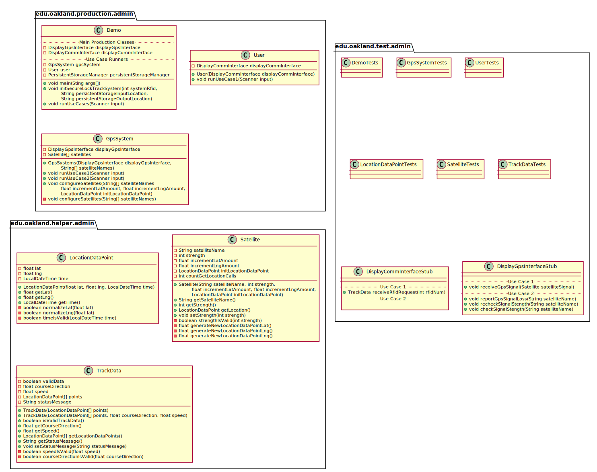
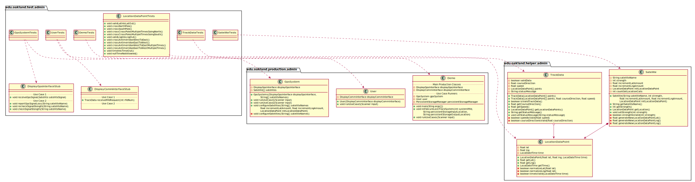
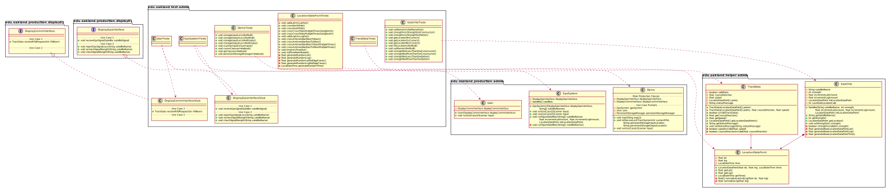

# UML Class Diagrams: Admin Subteam Packages

**Primary Owner:** Tessa Peruzzi, Project SCRUM Master ([@TessaPeruzzi](https://github.com/TessaPeruzzi/))

**Secondary Owners:**

- Brendan Fraser, Project SCRUM Assistant Master ([@brendanfraser597](https://github.com/brendanfraser597/))
- Andrew Dimmer, Project SCRUM Integration Master ([@andrewdimmer](https://github.com/andrewdimmer/))

## Purpose

This set of packages shall provide a means of demonstrating the System's functionality.

## Packages

This subteam owns the following packages:

- [edu.oakland.production.admin](production)
- [edu.oakland.helper.admin](helper)
- [edu.oakland.test.admin](test)

## Class UML Diagram

Below is a diagram of the Admin Subteam packages themselves:

View larger as [.png](./AdminPackages.png) or [.svg](./AdminPackages.svg)

## Internal Dependencies UML Diagram

Below is a diagram of the internal dependencies within the Admin Subteam packages:

View larger as [.png](./AdminPackages_InternalDependencies.png) or [.svg](./AdminPackages_InternalDependencies.svg)

## Direct Dependencies UML Diagram

Below is a diagram of the direct dependencies required by the Admin Subteam packages:

View larger as [.png](./AdminPackages_DirectDependencies.png) or [.svg](./AdminPackages_DirectDependencies.svg)

## Complete Dependency Closure UML Diagram

Below is a diagram of the complete dependencies closure of the Admin Subteam packages:

View larger as [.png](./AdminPackages_Closure.png) or [.svg](./AdminPackages_Closure.svg)
