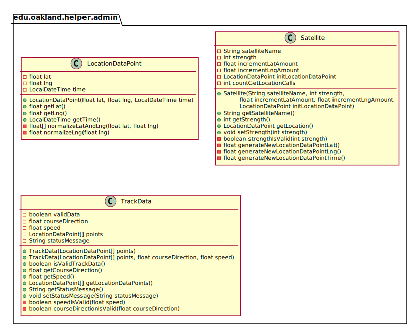
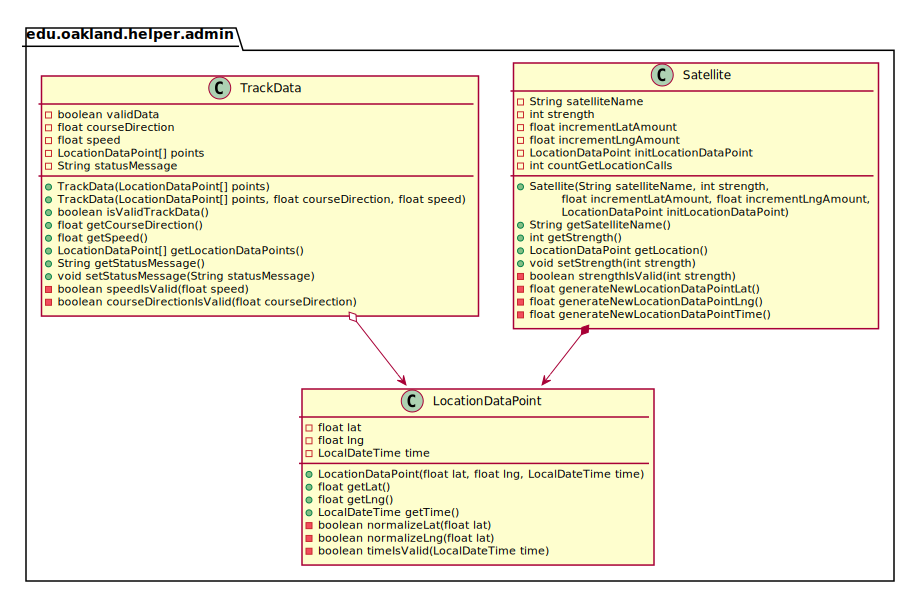
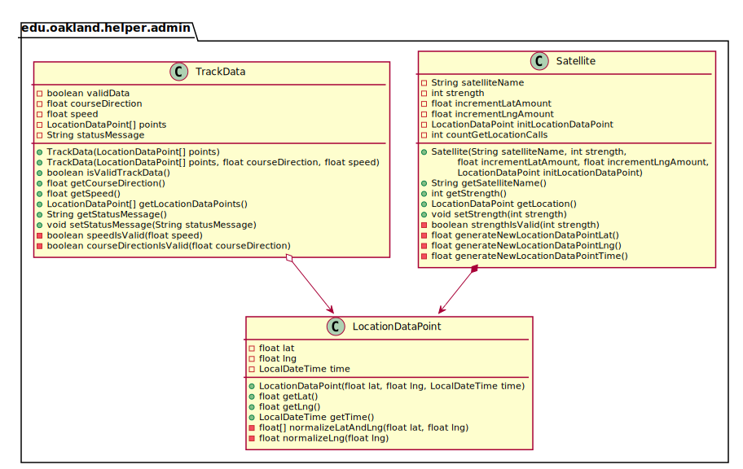

# UML Class Diagrams: edu.oakland.helper.admin

**Primary Owner:** Tessa Peruzzi, Project SCRUM Master ([@TessaPeruzzi](https://github.com/TessaPeruzzi/))

**Secondary Owners:**

- Brendan Fraser, Project SCRUM Assistant Master ([@brendanfraser597](https://github.com/brendanfraser597/))
- Andrew Dimmer, Project SCRUM Integration Master ([@andrewdimmer](https://github.com/andrewdimmer/))

## Purpose

This package shall provide classes that hold data to be passed around within the system.

## Intrerfaces

This package does not contain any interfaces.

## Classes

This package contains the following classes:

- [edu.oakland.helper.admin.LocationDataPoint](LocationDataPoint)
- [edu.oakland.helper.admin.Satellite](Satellite)
- [edu.oakland.helper.admin.TrackData](TrackData)

## Class UML Diagram

Below is a diagram of the edu.oakland.helper.admin package itself:

View larger as [.png](./AdminHelperPackage.png) or [.svg](./AdminHelperPackage.svg)

## Internal Dependencies UML Diagram

Below is a diagram of the internal dependencies within the edu.oakland.helper.admin package:

View larger as [.png](./AdminHelperPackage_InternalDependencies.png) or [.svg](./AdminHelperPackage_InternalDependencies.svg)

## Direct Dependencies UML Diagram

Below is a diagram of the direct dependencies required by the edu.oakland.helper.admin package:

View larger as [.png](./AdminHelperPackage_DirectDependencies.png) or [.svg](./AdminHelperPackage_DirectDependencies.svg)

## Complete Dependency Closure UML Diagram

Below is a diagram of the complete dependencies closure of the edu.oakland.helper.admin package:

View larger as [.png](./AdminHelperPackage_Closure.png) or [.svg](./AdminHelperPackage_Closure.svg)
