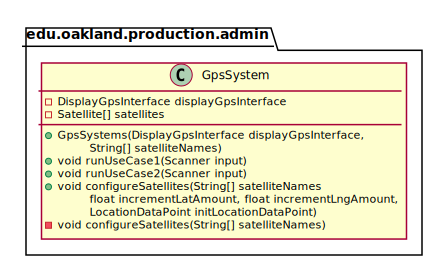

# UML Class Diagrams: edu.oakland.production.admin.GpsSystem

**Primary Owner:** Tessa Peruzzi, Project SCRUM Master ([@TessaPeruzzi](https://github.com/TessaPeruzzi/))

**Secondary Owners:**

- Brendan Fraser, Project SCRUM Assistant Master ([@brendanfraser597](https://github.com/brendanfraser597/))
- Andrew Dimmer, Project SCRUM Integration Master ([@andrewdimmer](https://github.com/andrewdimmer/))

## Purpose

This class shall contain the GPS systems and initiate Use Case 2 when the SLTS loses lock on either system.

## Class UML Diagram

Below is a diagram of the GpsSystem class itself:

View larger as [.png](./GpsSystem.png) or [.svg](./GpsSystem.svg)

## Direct Dependencies UML Diagram

Below is a diagram of the direct dependencies required by the GpsSystem class:

View larger as [.png](./GpsSystem_DirectDependencies.png) or [.svg](./GpsSystem_DirectDependencies.svg)

## Complete Dependency Closure UML Diagram

Below is a diagram of the complete dependencies closure of the GpsSystem class:

View larger as [.png](./GpsSystem_Closure.png) or [.svg](./GpsSystem_Closure.svg)
