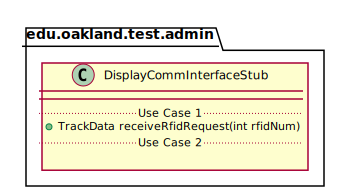
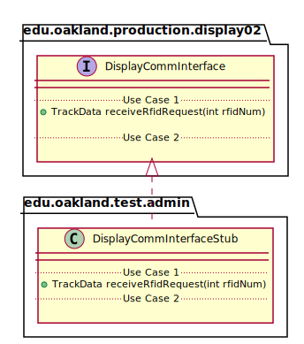
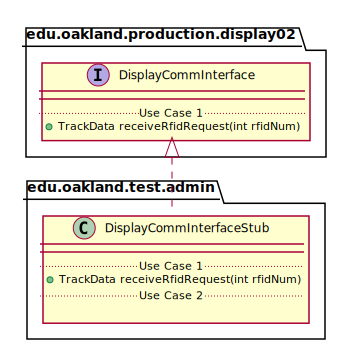

# UML Class Diagrams: edu.oakland.test.admin.DisplayCommInterfaceStub

**Primary Owner:** Tessa Peruzzi, Project SCRUM Master ([@TessaPeruzzi](https://github.com/TessaPeruzzi/))

**Secondary Owners:**

- Brendan Fraser, Project SCRUM Assistant Master ([@brendanfraser597](https://github.com/brendanfraser597/))
- Andrew Dimmer, Project SCRUM Integration Master ([@andrewdimmer](https://github.com/andrewdimmer/))

## Purpose

This class shall act as a stub of [edu.oakland.production.display02.DisplayCommInterface](../../../display02/production/DisplayCommInterface) for testing.

## Class UML Diagram

Below is a diagram of the DisplayCommInterfaceStub class itself:

View larger as [.png](./DisplayCommInterfaceStub.png) or [.svg](./DisplayCommInterfaceStub.svg)

## Direct Dependencies UML Diagram

Below is a diagram of the direct dependencies required by the DisplayCommInterfaceStub class:

View larger as [.png](./DisplayCommInterfaceStub_DirectDependencies.png) or [.svg](./DisplayCommInterfaceStub_DirectDependencies.svg)

## Complete Dependency Closure UML Diagram

Below is a diagram of the complete dependencies closure of the DisplayCommInterfaceStub class:

View larger as [.png](./DisplayCommInterfaceStub_Closure.png) or [.svg](./DisplayCommInterfaceStub_Closure.svg)
