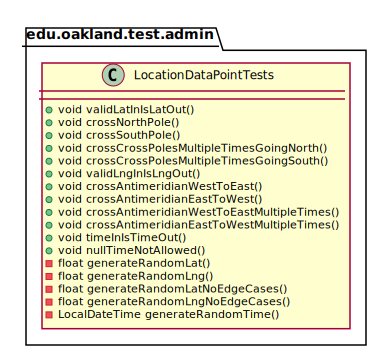
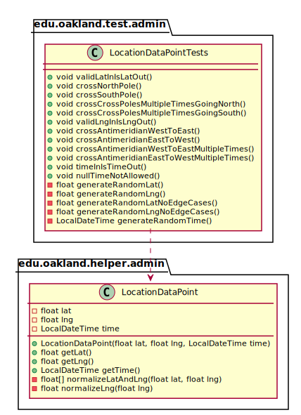

# UML Class Diagrams: edu.oakland.test.admin.LocationDataPointTests

**Primary Owner:** Tessa Peruzzi, Project SCRUM Master ([@TessaPeruzzi](https://github.com/TessaPeruzzi/))

**Secondary Owners:**

- Brendan Fraser, Project SCRUM Assistant Master ([@brendanfraser597](https://github.com/brendanfraser597/))
- Andrew Dimmer, Project SCRUM Integration Master ([@andrewdimmer](https://github.com/andrewdimmer/))

## Purpose

This class shall run unit tests on the [edu.oakland.helper.admin.LocationDataPoint](../../helper/LocationDataPoint) class.

## Class UML Diagram

Below is a diagram of the LocationDataPointTests class itself:

View larger as [.png](./LocationDataPointTests.png) or [.svg](./LocationDataPointTests.svg)

## Direct Dependencies UML Diagram

Below is a diagram of the direct dependencies required by the LocationDataPointTests class:

View larger as [.png](./LocationDataPointTests_DirectDependencies.png) or [.svg](./LocationDataPointTests_DirectDependencies.svg)

## Complete Dependency Closure UML Diagram

Below is a diagram of the complete dependencies closure of the LocationDataPointTests class:

View larger as [.png](./LocationDataPointTests_Closure.png) or [.svg](./LocationDataPointTests_Closure.svg)
