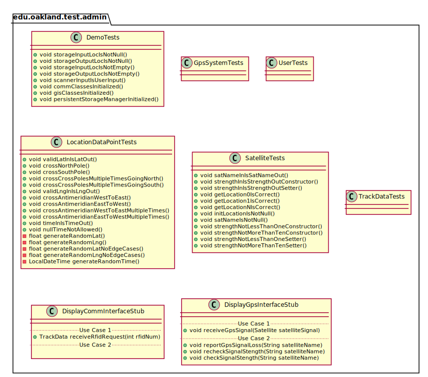
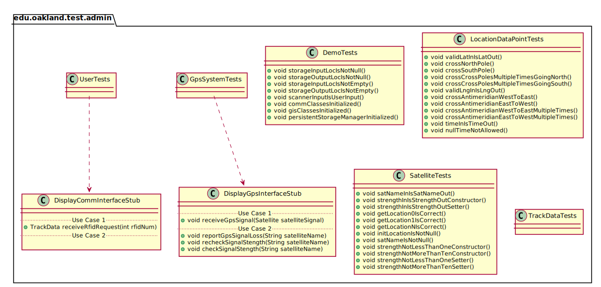
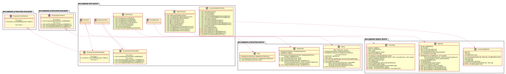
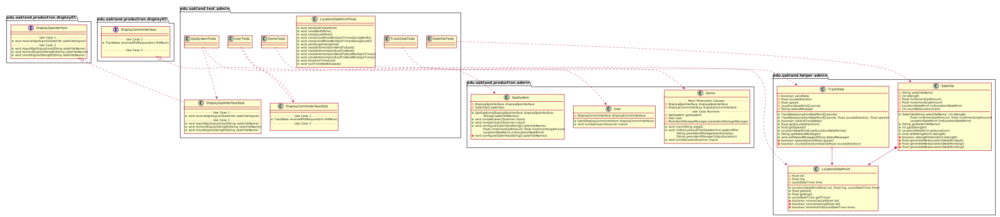

# UML Class Diagrams: edu.oakland.test.admin

**Primary Owner:** Tessa Peruzzi, Project SCRUM Master ([@TessaPeruzzi](https://github.com/TessaPeruzzi/))

**Secondary Owners:**

- Brendan Fraser, Project SCRUM Assistant Master ([@brendanfraser597](https://github.com/brendanfraser597/))
- Andrew Dimmer, Project SCRUM Integration Master ([@andrewdimmer](https://github.com/andrewdimmer/))

## Purpose

This package shall provide a means of testing the functionality of the System.

## Intrerfaces

This package does not contain any interfaces.

## Classes

### Unit Test Classes

This package contains the following unit test classes:

- [edu.oakland.test.admin.DemoTests](DemoTests)
- [edu.oakland.test.admin.UserTests](UserTests)
- [edu.oakland.test.admin.GpsSystemTests](GpsSystemTests)
- [edu.oakland.test.admin.LocationDataPointTests](LocationDataPointTests)
- [edu.oakland.test.admin.SatelliteTests](SatelliteTests)
- [edu.oakland.test.admin.TrackDataTests](TrackDataTests)

## Test Stub Classes

This package contains the following unit test classes:

- [edu.oakland.test.admin.DisplayCommInterfaceStub](DisplayCommInterfaceStub)
- [edu.oakland.test.admin.DisplayGpsInterfaceStub](DisplayGpsInterfaceStub)

## Class UML Diagram

Below is a diagram of the edu.oakland.test.admin package itself:

View larger as [.png](./AdminTestPackage.png) or [.svg](./AdminTestPackage.svg)

## Internal Dependencies UML Diagram

Below is a diagram of the internal dependencies within the edu.oakland.test.admin package:

View larger as [.png](./AdminTestPackage_InternalDependencies.png) or [.svg](./AdminTestPackage_InternalDependencies.svg)

## Direct Dependencies UML Diagram

Below is a diagram of the direct dependencies required by the edu.oakland.test.admin package:

View larger as [.png](./AdminTestPackage_DirectDependencies.png) or [.svg](./AdminTestPackage_DirectDependencies.svg)

## Complete Dependency Closure UML Diagram

Below is a diagram of the complete dependencies closure of the edu.oakland.test.admin package:

View larger as [.png](./AdminTestPackage_Closure.png) or [.svg](./AdminTestPackage_Closure.svg)
