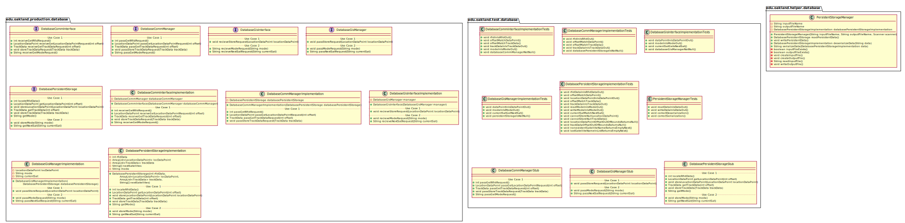
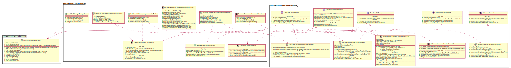
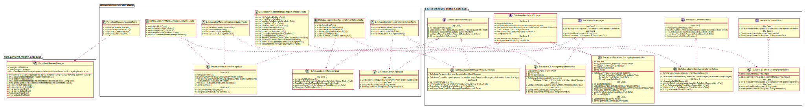
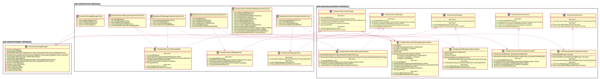

# UML Class Diagrams: Database Subteam Packages

**Primary Owner:** Cam'Ron Grant, Database Team SCRUM Master ([@camrongrant1](https://github.com/camrongrant1/))

**Secondary Owners:**

- Kyle Poterek, Database Team SCRUM Assistant Master ([@kylepoterek](https://github.com/kylepoterek/))
- Mathew Yaldo, Database Team SCRUM Integrator ([@MathewYaldo](https://github.com/MathewYaldo/))

## Purpose

This set of packages shall maintain the database for GIS and Comm, and also pass/request data from middleware.

## Packages

This subteam owns the following packages:

- [edu.oakland.production.database](production)
- [edu.oakland.helper.database](helper)
- [edu.oakland.test.database](test)

## Class UML Diagram

Below is a diagram of the Database Subteam packages themselves:

View larger as [.png](./DatabasePackages.png) or [.svg](./DatabasePackages.svg)

## Internal Dependencies UML Diagram

Below is a diagram of the internal dependencies within the Database Subteam packages:

View larger as [.png](./DatabasePackages_InternalDependencies.png) or [.svg](./DatabasePackages_InternalDependencies.svg)

## Direct Dependencies UML Diagram

Below is a diagram of the direct dependencies required by the Database Subteam packages:

View larger as [.png](./DatabasePackages_DirectDependencies.png) or [.svg](./DatabasePackages_DirectDependencies.svg)

## Complete Dependency Closure UML Diagram

Below is a diagram of the complete dependencies closure of the Database Subteam packages:

View larger as [.png](./DatabasePackages_Closure.png) or [.svg](./DatabasePackages_Closure.svg)
