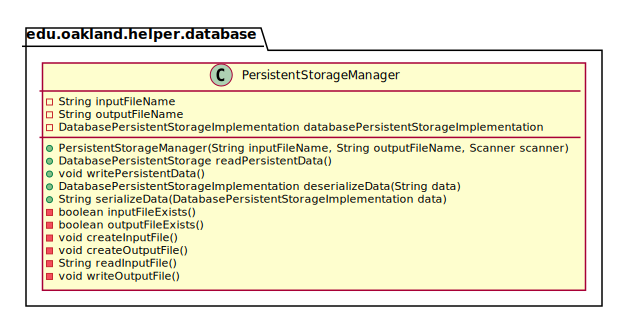
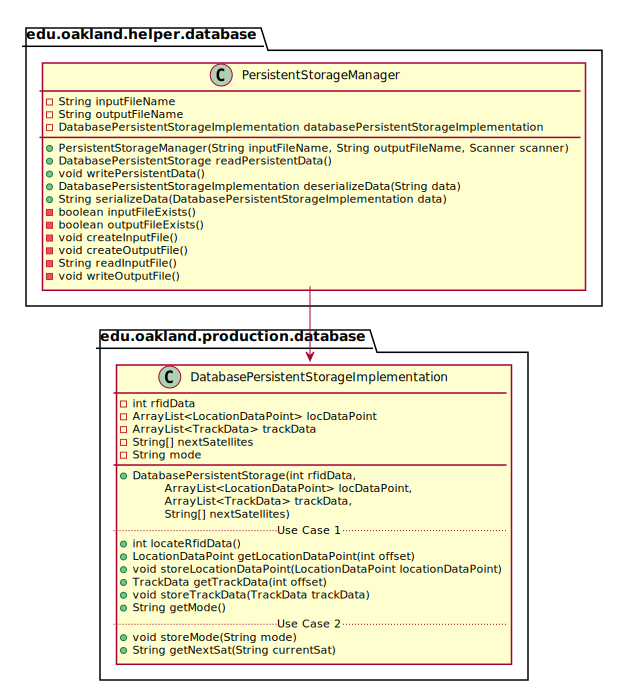
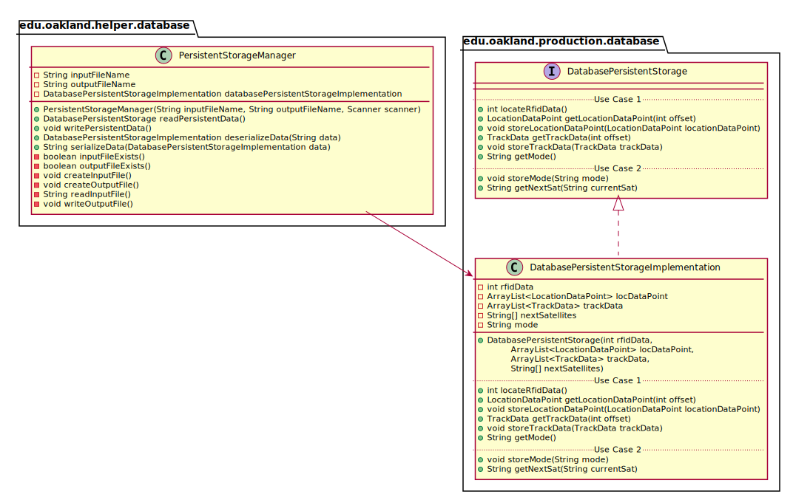

# UML Class Diagrams: edu.oakland.helper.display_01.PersistentStorageManager

**Primary Owner:** Cam'Ron Grant, Database Team SCRUM Master ([@camrongrant1](https://github.com/camrongrant1/))

**Secondary Owners:**

- Kyle Poterek, Database Team SCRUM Assistant Master ([@kylepoterek](https://github.com/kylepoterek/))
- Mathew Yaldo, Database Team SCRUM Integrator ([@MathewYaldo](https://github.com/MathewYaldo/))

## Purpose

This class shall pass load and store data from DatabasePersistentStorage and the file system.

## Class UML Diagram

Below is a diagram of the PersistentStorageManager class itself:

View larger as [.png](./PersistentStorageManager.png) or [.svg](./PersistentStorageManager.svg)

## Direct Dependencies UML Diagram

Below is a diagram of the direct dependencies required by the PersistentStorageManager class:

View larger as [.png](./PersistentStorageManager_DirectDependencies.png) or [.svg](./PersistentStorageManager_DirectDependencies.svg)

## Complete Dependency Closure UML Diagram

Below is a diagram of the complete dependencies closure of the PersistentStorageManager class:

View larger as [.png](./PersistentStorageManager_Closure.png) or [.svg](./PersistentStorageManager_Closure.svg)
