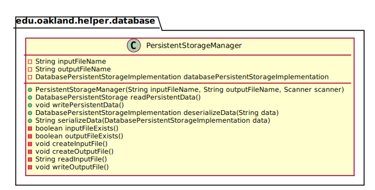
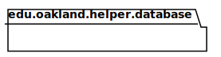

# UML Class Diagrams: edu.oakland.helper.database

**Primary Owner:** Cam'Ron Grant, Database Team SCRUM Master ([@camrongrant1](https://github.com/camrongrant1/))

**Secondary Owners:**

- Kyle Poterek, Database Team SCRUM Assistant Master ([@kylepoterek](https://github.com/kylepoterek/))
- Mathew Yaldo, Database Team SCRUM Integrator ([@MathewYaldo](https://github.com/MathewYaldo/))

## Purpose

This package shall provide classes necessary for proper storing of data.

## Intrerfaces

This package does not contain any interfaces.

## Classes

This package contains the following classes:

- [edu.oakland.helper.database.PersistentStorageManager](PersistentStorageManager)

## Class UML Diagram

Below is a diagram of the edu.oakland.helper.database package itself:

View larger as [.png](./DatabaseHelperPackage.png) or [.svg](./DatabaseHelperPackage.svg)

## Internal Dependencies UML Diagram

Below is a diagram of the internal dependencies within the edu.oakland.helper.database package:

View larger as [.png](./DatabaseHelperPackage_InternalDependencies.png) or [.svg](./DatabaseHelperPackage_InternalDependencies.svg)

## Direct Dependencies UML Diagram

Below is a diagram of the direct dependencies required by the edu.oakland.helper.database package:

View larger as [.png](./DatabaseHelperPackage_DirectDependencies.png) or [.svg](./DatabaseHelperPackage_DirectDependencies.svg)

## Complete Dependency Closure UML Diagram

Below is a diagram of the complete dependencies closure of the edu.oakland.helper.database package:

View larger as [.png](./DatabaseHelperPackage_Closure.png) or [.svg](./DatabaseHelperPackage_Closure.svg)
