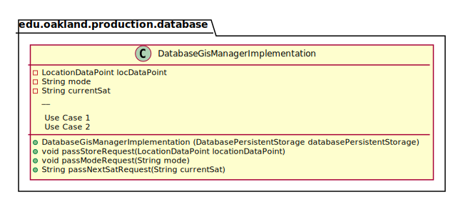
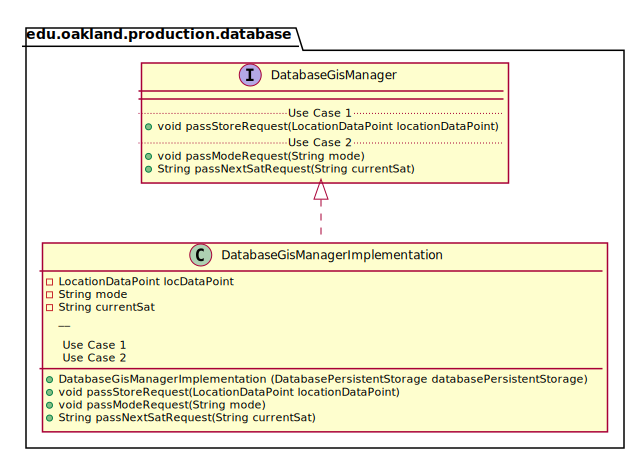
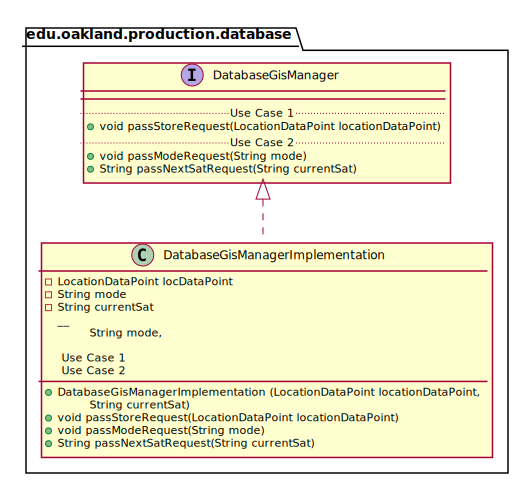

# UML Class Diagrams: edu.oakland.production.database.DatabaseGisManagerImplementation

**Primary Owner:** Cam'Ron Grant, Database Team SCRUM Master ([@camrongrant1](https://github.com/camrongrant1/))

**Secondary Owners:**

- Kyle Poterek, Database Team SCRUM Assistant Master ([@kylepoterek](https://github.com/kylepoterek/))
- Mathew Yaldo, Database Team SCRUM Integrator ([@MathewYaldo](https://github.com/MathewYaldo/))

## Purpose

This class shall store the necessary information from the interface to storage.

## Class UML Diagram

Below is a diagram of the DatabaseGisManagerImplementation class itself:

View larger as [.png](./DatabaseGisManagerImplementation.png) or [.svg](./DatabaseGisManagerImplementation.svg)

## Direct Dependencies UML Diagram

Below is a diagram of the direct dependencies required by the DatabaseGisManagerImplementation class:

View larger as [.png](./DatabaseGisManagerImplementation_DirectDependencies.png) or [.svg](./DatabaseGisManagerImplementation_DirectDependencies.svg)

## Complete Dependency Closure UML Diagram

Below is a diagram of the complete dependencies closure of the DatabaseGisManagerImplementation class:

View larger as [.png](./DatabaseGisManagerImplementation_Closure.png) or [.svg](./DatabaseGisManagerImplementation_Closure.svg)
