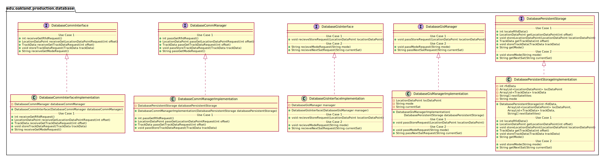

# UML Class Diagrams: edu.oakland.production.database

**Primary Owner:** Cam'Ron Grant, Database Team SCRUM Master ([@camrongrant1](https://github.com/camrongrant1/))

**Secondary Owners:**

- Kyle Poterek, Database Team SCRUM Assistant Master ([@kylepoterek](https://github.com/kylepoterek/))
- Mathew Yaldo, Database Team SCRUM Integrator ([@MathewYaldo](https://github.com/MathewYaldo/))

## Purpose

This package shall contain the classes needed to persistently store data, provide functions for middleware to access the database, and communicate between the interface to middleware and the persisent storage.

## Interfaces

This package contains the following interfaces:

- [edu.oakland.production.database.DatabaseCommInterface](DatabaseCommInterface)
- [edu.oakland.helper.database.DatabaseCommManager](DatabaseCommManager)
- [edu.oakland.production.database.DatabaseGisInterface](DatabaseGisInterface)
- [edu.oakland.helper.database.DatabaseGisManager](DatabaseGisManager)
- [edu.oakland.test.database.DatabasePersistentStorage](DatabasePersistentStorage)

## Classes

This package contains the following classes:

- [edu.oakland.production.database.DatabaseCommInterfaceImplementation](DatabaseCommInterfaceImplementation)
- [edu.oakland.helper.database.DatabaseCommManagerImplementation](DatabaseCommManagerImplementation)
- [edu.oakland.production.database.DatabaseGisInterfaceImplementation](DatabaseGisInterfaceImplementation)
- [edu.oakland.helper.database.DatabaseGisManagerImplementation](DatabaseGisManagerImplementation)
- [edu.oakland.test.database.DatabasePersistentStorageImplementation](DatabasePersistentStorageImplementation)

## Class UML Diagram

Below is a diagram of the edu.oakland.production.database package itself:

View larger as [.png](./DatabaseProductionPackage.png) or [.svg](./DatabaseProductionPackage.svg)

## Internal Dependencies UML Diagram

Below is a diagram of the internal dependencies within the edu.oakland.production.database package:

View larger as [.png](./DatabaseProductionPackage_InternalDependencies.png) or [.svg](./DatabaseProductionPackage_InternalDependencies.svg)

## Direct Dependencies UML Diagram

Below is a diagram of the direct dependencies required by the edu.oakland.production.database package:

View larger as [.png](./DatabaseProductionPackage_DirectDependencies.png) or [.svg](./DatabaseProductionPackage_DirectDependencies.svg)

## Complete Dependency Closure UML Diagram

Below is a diagram of the complete dependencies closure of the edu.oakland.production.database package:

View larger as [.png](./DatabaseProductionPackage_Closure.png) or [.svg](./DatabaseProductionPackage_Closure.svg)
