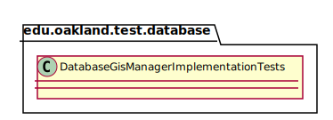
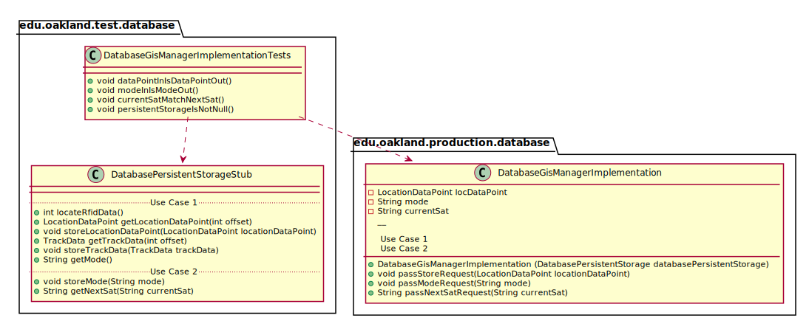
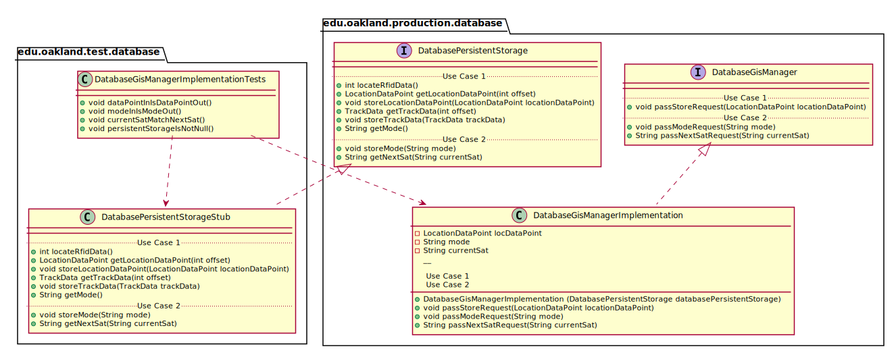

# UML Class Diagrams: edu.oakland.test.database.DatabaseGisManagerImplementationTests

**Primary Owner:** Cam'Ron Grant, Database Team SCRUM Master ([@camrongrant1](https://github.com/camrongrant1/))

**Secondary Owners:**

- Kyle Poterek, Database Team SCRUM Assistant Master ([@kylepoterek](https://github.com/kylepoterek/))
- Mathew Yaldo, Database Team SCRUM Integrator ([@MathewYaldo](https://github.com/MathewYaldo/))

## Purpose

This class shall run unit tests on the [edu.oakland.production.database.DatabaseGisManagerImplementation](../../production/DatabaseGisManagerImplementation) class.

## Class UML Diagram

Below is a diagram of the DatabaseGisManagerImplementationTests interface itself:

View larger as [.png](./DatabaseGisManagerImplementationTests.png) or [.svg](./DatabaseGisManagerImplementationTests.svg)

## Direct Dependencies UML Diagram

Below is a diagram of the direct dependencies required by the DatabaseGisManagerImplementationTests interface:

View larger as [.png](./DatabaseGisManagerImplementationTests_DirectDependencies.png) or [.svg](./DatabaseGisManagerImplementationTests_DirectDependencies.svg)

## Complete Dependency Closure UML Diagram

Below is a diagram of the complete dependencies closure of the DatabaseGisManagerImplementationTests interface:

View larger as [.png](./DatabaseGisManagerImplementationTests_Closure.png) or [.svg](./DatabaseGisManagerImplementationTests_Closure.svg)
