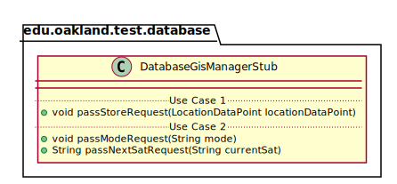
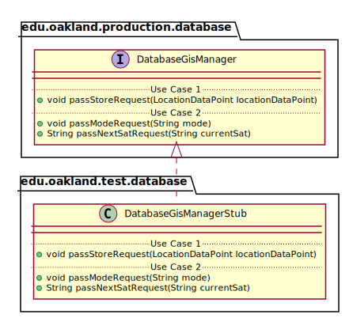

# UML Class Diagrams: edu.oakland.production.database.DatabaseGisManagerStub

**Primary Owner:** Cam'Ron Grant, Database Team SCRUM Master ([@camrongrant1](https://github.com/camrongrant1/))

**Secondary Owners:**

- Kyle Poterek, Database Team SCRUM Assistant Master ([@kylepoterek](https://github.com/kylepoterek/))
- Mathew Yaldo, Database Team SCRUM Integrator ([@MathewYaldo](https://github.com/MathewYaldo/))

## Purpose

This class shall act as a stub of [edu.oakland.production.database.DatabaseGisManager](../../production/DatabaseGisManager) for testing.

## Class UML Diagram

Below is a diagram of the DatabaseGisManagerStub class itself:

View larger as [.png](./DatabaseGisManagerStub.png) or [.svg](./DatabaseGisManagerStub.svg)

## Direct Dependencies UML Diagram

Below is a diagram of the direct dependencies required by the DatabaseGisManagerStub class:

View larger as [.png](./DatabaseGisManagerStub_DirectDependencies.png) or [.svg](./DatabaseGisManagerStub_DirectDependencies.svg)

## Complete Dependency Closure UML Diagram

Below is a diagram of the complete dependencies closure of the DatabaseGisManagerStub class:

View larger as [.png](./DatabaseGisManagerStub_Closure.png) or [.svg](./DatabaseGisManagerStub_Closure.svg)
