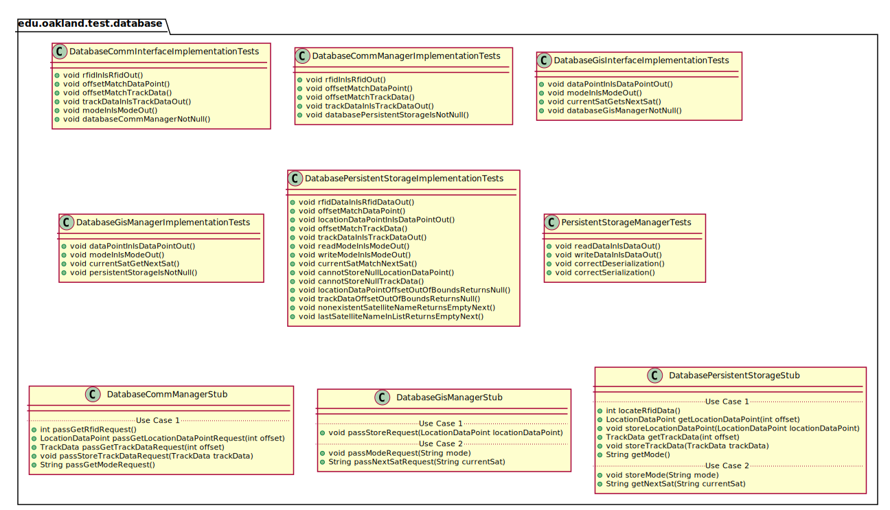
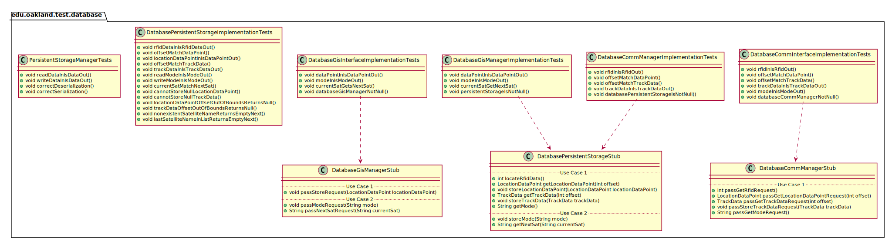
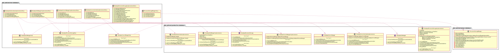
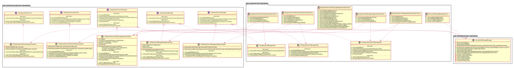

# UML Class Diagrams: edu.oakland.test.database

**Primary Owner:** Cam'Ron Grant, Database Team SCRUM Master ([@camrongrant1](https://github.com/camrongrant1/))

**Secondary Owners:**

- Kyle Poterek, Database Team SCRUM Assistant Master ([@kylepoterek](https://github.com/kylepoterek/))
- Mathew Yaldo, Database Team SCRUM Integrator ([@MathewYaldo](https://github.com/MathewYaldo/))

## Purpose

This package shall contain the test methods for database.

## Intrerfaces

This package does not contain any interfaces.

## Classes

### Unit Test Classes

This package contains the following unit test classes:

- [edu.oakland.test.database.DatabaseCommInterfaceImplementationTests](DatabaseCommInterfaceImplementationTests)
- [edu.oakland.test.database.DatabaseCommManagerImplementationTests](DatabaseCommManagerImplementationTests)
- [edu.oakland.test.database.DatabaseGisInterfaceImplementationTests](DatabaseGisInterfaceImplementationTests)
- [edu.oakland.test.database.DatabaseGisManagerImplementationTests](DatabaseGisManagerImplementationTests)
- [edu.oakland.test.database.DatabasePersistentStorageImplementationTests](DatabasePersistentStorageImplementationTests)
- [edu.oakland.test.database.PersistentStorageManagerTests](PersistentStorageManagerTests)

## Test Stub Classes

This package contains the following unit test classes:

- [edu.oakland.test.database.DatabaseCommManagerStub](DatabaseCommManagerStub)
- [edu.oakland.test.database.DatabaseGisManagerStub](DatabaseGisManagerStub)
- [edu.oakland.test.database.DatabasePersistentStorageStub](DatabasePersistentStorageStub)

## Class UML Diagram

Below is a diagram of the edu.oakland.test.database package itself:

View larger as [.png](./DatabaseTestPackage.png) or [.svg](./DatabaseTestPackage.svg)

## Internal Dependencies UML Diagram

Below is a diagram of the internal dependencies within the edu.oakland.test.database package:

View larger as [.png](./DatabaseTestPackage_InternalDependencies.png) or [.svg](./DatabaseTestPackage_InternalDependencies.svg)

## Direct Dependencies UML Diagram

Below is a diagram of the direct dependencies required by the edu.oakland.test.database package:

View larger as [.png](./DatabaseTestPackage_DirectDependencies.png) or [.svg](./DatabaseTestPackage_DirectDependencies.svg)

## Complete Dependency Closure UML Diagram

Below is a diagram of the complete dependencies closure of the edu.oakland.test.database package:

View larger as [.png](./DatabaseTestPackage_Closure.png) or [.svg](./DatabaseTestPackage_Closure.svg)
