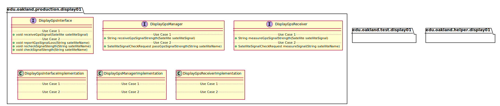
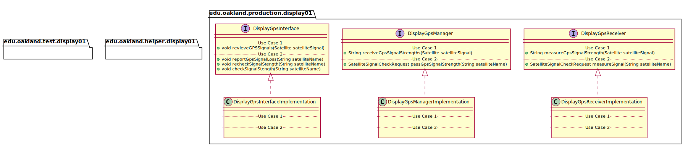
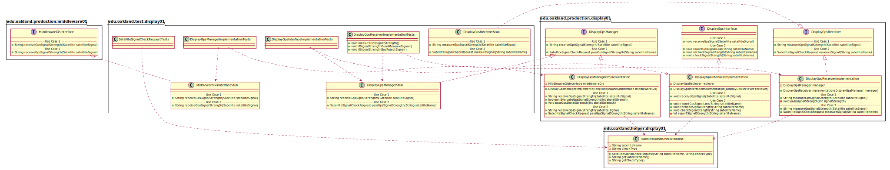

# UML Class Diagrams: Display_01 Subteam Packages

**Primary Owner:** Eric Chan, Display_01 Team SCRUM Master ([@EC01EC](https://github.com/EC01EC/))

**Secondary Owners:**

- Steve Catherman, Display_01 Team SCRUM Assistant Master ([@stevecatherman](https://github.com/stevecatherman/))
- Cody Asher, Display_01 Team SCRUM Integrator ([@casher-ou](https://github.com/casher-ou/))

## Purpose

This set of packages shall receive GPS signals and pass them to Middleware.

## Packages

This subteam owns the following packages:

- [edu.oakland.production.display01](production)
- [edu.oakland.helper.display01](helper)
- [edu.oakland.test.display01](test)

## Class UML Diagram

Below is a diagram of the Display_01 Subteam packages themselves:

View larger as [.png](./Display01Packages.png) or [.svg](./Display01Packages.svg)

## Internal Dependencies UML Diagram

Below is a diagram of the internal dependencies within the Display_01 Subteam packages:

View larger as [.png](./Display01Packages_InternalDependencies.png) or [.svg](./Display01Packages_InternalDependencies.svg)

## Direct Dependencies UML Diagram

Below is a diagram of the direct dependencies required by the Display_01 Subteam packages:

View larger as [.png](./Display01Packages_DirectDependencies.png) or [.svg](./Display01Packages_DirectDependencies.svg)

## Complete Dependency Closure UML Diagram

Below is a diagram of the complete dependencies closure of the Display_01 Subteam packages:

View larger as [.png](./Display01Packages_Closure.png) or [.svg](./Display01Packages_Closure.svg)
