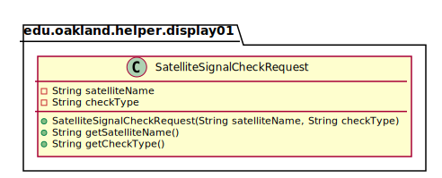
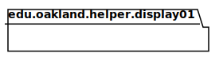

# UML Class Diagrams: edu.oakland.helper.display01

**Primary Owner:** Eric Chan, Display_01 Team SCRUM Master ([@EC01EC](https://github.com/EC01EC/))

**Secondary Owners:**

- Steve Catherman, Display_01 Team SCRUM Assistant Master ([@stevecatherman](https://github.com/stevecatherman/))
- Cody Asher, Display_01 Team SCRUM Integrator ([@casher-ou](https://github.com/casher-ou/))

## Purpose

This package shall provide the class that determines the origin of a satellite signal.

## Intrerfaces

This package does not contain any interfaces.

## Classes

This package contains the following classes:

- [edu.oakland.helper.display01.SatelliteSignalCheckRequest](SatelliteSignalCheckRequest)

## Class UML Diagram

Below is a diagram of the edu.oakland.helper.display01 package itself:

View larger as [.png](./Display01HelperPackage.png) or [.svg](./Display01HelperPackage.svg)

## Internal Dependencies UML Diagram

Below is a diagram of the internal dependencies within the edu.oakland.helper.display01 package:

View larger as [.png](./Display01HelperPackage_InternalDependencies.png) or [.svg](./Display01HelperPackage_InternalDependencies.svg)

## Direct Dependencies UML Diagram

Below is a diagram of the direct dependencies required by the edu.oakland.helper.display01 package:

View larger as [.png](./Display01HelperPackage_DirectDependencies.png) or [.svg](./Display01HelperPackage_DirectDependencies.svg)

## Complete Dependency Closure UML Diagram

Below is a diagram of the complete dependencies closure of the edu.oakland.helper.display01 package:

View larger as [.png](./Display01HelperPackage_Closure.png) or [.svg](./Display01HelperPackage_Closure.svg)
