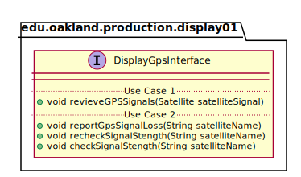

# UML Class Diagrams: edu.oakland.production.display01.DisplayGpsInterface

**Primary Owner:** Eric Chan, Display_01 Team SCRUM Master ([@EC01EC](https://github.com/EC01EC/))

**Secondary Owners:**

- Steve Catherman, Display_01 Team SCRUM Assistant Master ([@stevecatherman](https://github.com/stevecatherman/))
- Cody Asher, Display_01 Team SCRUM Integrator ([@casher-ou](https://github.com/casher-ou/))

## Purpose

This interface shall interact with the GPS systems and the Display GPS Receiver to relay GPS signal status.

## Class UML Diagram

Below is a diagram of the DisplayGpsInterface interface itself:

View larger as [.png](./DisplayGpsInterface.png) or [.svg](./DisplayGpsInterface.svg)

## Direct Dependencies UML Diagram

Below is a diagram of the direct dependencies required by the DisplayGpsInterface interface:

View larger as [.png](./DisplayGpsInterface_DirectDependencies.png) or [.svg](./DisplayGpsInterface_DirectDependencies.svg)

## Complete Dependency Closure UML Diagram

Below is a diagram of the complete dependencies closure of the DisplayGpsInterface interface:

View larger as [.png](./DisplayGpsInterface_Closure.png) or [.svg](./DisplayGpsInterface_Closure.svg)
