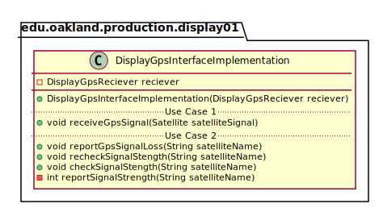
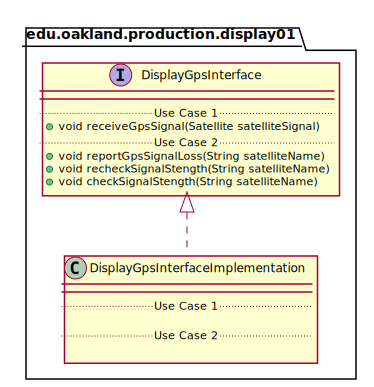
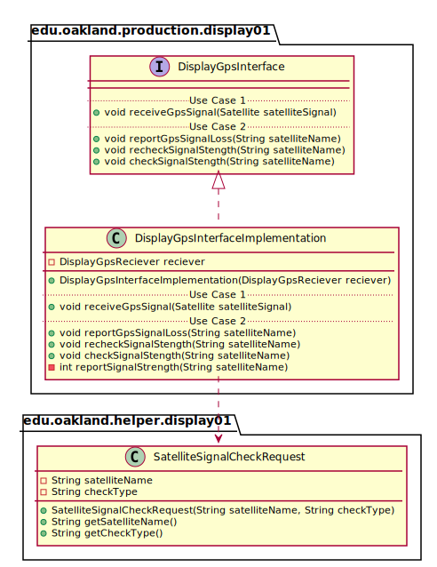

# UML Class Diagrams: edu.oakland.production.display01.DisplayGpsInterfaceImplementation

**Primary Owner:** Eric Chan, Display_01 Team SCRUM Master ([@EC01EC](https://github.com/EC01EC/))

**Secondary Owners:**

- Steve Catherman, Display_01 Team SCRUM Assistant Master ([@stevecatherman](https://github.com/stevecatherman/))
- Cody Asher, Display_01 Team SCRUM Integrator ([@casher-ou](https://github.com/casher-ou/))

## Purpose

This class shall interface between the GPS signal and middleware to provide signal data to the middleware classes.

## Class UML Diagram

Below is a diagram of the DisplayGpsInterfaceImplementation class itself:

View larger as [.png](./DisplayGpsInterfaceImplementation.png) or [.svg](./DisplayGpsInterfaceImplementation.svg)

## Direct Dependencies UML Diagram

Below is a diagram of the direct dependencies required by the DisplayGpsInterfaceImplementation class:

View larger as [.png](./DisplayGpsInterfaceImplementation_DirectDependencies.png) or [.svg](./DisplayGpsInterfaceImplementation_DirectDependencies.svg)

## Complete Dependency Closure UML Diagram

Below is a diagram of the complete dependencies closure of the DisplayGpsInterfaceImplementation class:

View larger as [.png](./DisplayGpsInterfaceImplementation_Closure.png) or [.svg](./DisplayGpsInterfaceImplementation_Closure.svg)
