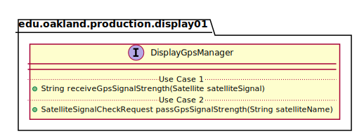

# UML Class Diagrams: edu.oakland.production.display01.DisplayGpsManager

**Primary Owner:** Eric Chan, Display_01 Team SCRUM Master ([@EC01EC](https://github.com/EC01EC/))

**Secondary Owners:**

- Steve Catherman, Display_01 Team SCRUM Assistant Master ([@stevecatherman](https://github.com/stevecatherman/))
- Cody Asher, Display_01 Team SCRUM Integrator ([@casher-ou](https://github.com/casher-ou/))

## Purpose

This interface shall facilitate the passing of GPS signals from the Receiver to Middleware.

## Class UML Diagram

Below is a diagram of the DisplayGpsManager interface itself:

View larger as [.png](./DisplayGpsManager.png) or [.svg](./DisplayGpsManager.svg)

## Direct Dependencies UML Diagram

Below is a diagram of the direct dependencies required by the DisplayGpsManager interface:

View larger as [.png](./DisplayGpsManager_DirectDependencies.png) or [.svg](./DisplayGpsManager_DirectDependencies.svg)

## Complete Dependency Closure UML Diagram

Below is a diagram of the complete dependencies closure of the DisplayGpsManager interface:

View larger as [.png](./DisplayGpsManager_Closure.png) or [.svg](./DisplayGpsManager_Closure.svg)
