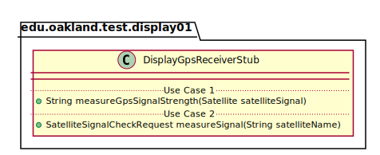
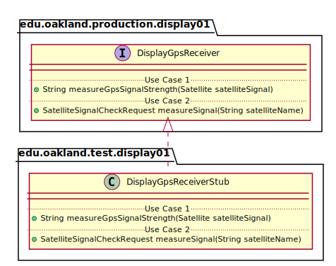

# UML Class Diagrams: edu.oakland.production.display01.DisplayGpsReceiverStub

**Primary Owner:** Eric Chan, Display_01 Team SCRUM Master ([@EC01EC](https://github.com/EC01EC/))

**Secondary Owners:**

- Steve Catherman, Display_01 Team SCRUM Assistant Master ([@stevecatherman](https://github.com/stevecatherman/))
- Cody Asher, Display_01 Team SCRUM Integrator ([@casher-ou](https://github.com/casher-ou/))

## Purpose

This class shall act as a stub of [edu.oakland.production.display01.DisplayGpsReceiver](../../production/DisplayGpsReceiver) for testing.

## Class UML Diagram

Below is a diagram of the DisplayGpsReceiverStub class itself:

View larger as [.png](./DisplayGpsReceiverStub.png) or [.svg](./DisplayGpsReceiverStub.svg)

## Direct Dependencies UML Diagram

Below is a diagram of the direct dependencies required by the DisplayGpsReceiverStub class:

View larger as [.png](./DisplayGpsReceiverStub_DirectDependencies.png) or [.svg](./DisplayGpsReceiverStub_DirectDependencies.svg)

## Complete Dependency Closure UML Diagram

Below is a diagram of the complete dependencies closure of the DisplayGpsReceiverStub class:

View larger as [.png](./DisplayGpsReceiverStub_Closure.png) or [.svg](./DisplayGpsReceiverStub_Closure.svg)
