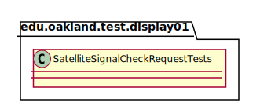
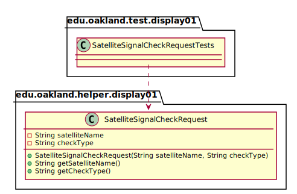

# UML Class Diagrams: edu.oakland.test.display01.SatelliteSignalCheckRequestTests

**Primary Owner:** Eric Chan, Display_01 Team SCRUM Master ([@EC01EC](https://github.com/EC01EC/))

**Secondary Owners:**

- Steve Catherman, Display_01 Team SCRUM Assistant Master ([@stevecatherman](https://github.com/stevecatherman/))
- Cody Asher, Display_01 Team SCRUM Integrator ([@casher-ou](https://github.com/casher-ou/))

## Purpose

This class shall run unit tests on the [edu.oakland.helper.display01.SatelliteSignalCheckRequest](../../helper/SatelliteSignalCheckRequest) class.

## Class UML Diagram

Below is a diagram of the SatelliteSignalCheckRequestTests class itself:

View larger as [.png](./SatelliteSignalCheckRequestTests.png) or [.svg](./SatelliteSignalCheckRequestTests.svg)

## Direct Dependencies UML Diagram

Below is a diagram of the direct dependencies required by the SatelliteSignalCheckRequestTests class:

View larger as [.png](./SatelliteSignalCheckRequestTests_DirectDependencies.png) or [.svg](./SatelliteSignalCheckRequestTests_DirectDependencies.svg)

## Complete Dependency Closure UML Diagram

Below is a diagram of the complete dependencies closure of the SatelliteSignalCheckRequestTests class:

View larger as [.png](./SatelliteSignalCheckRequestTests_Closure.png) or [.svg](./SatelliteSignalCheckRequestTests_Closure.svg)
