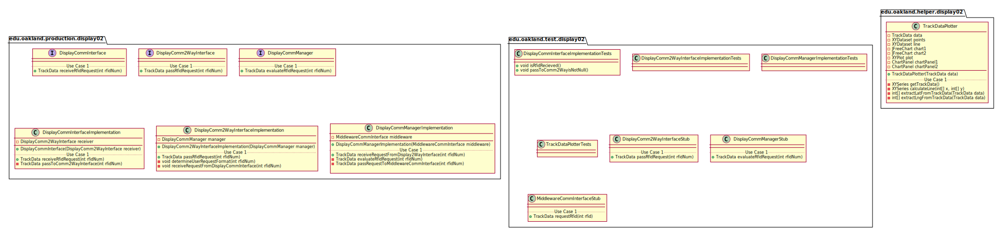
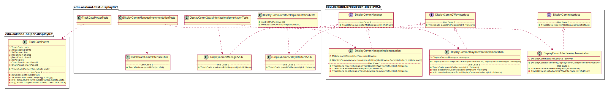
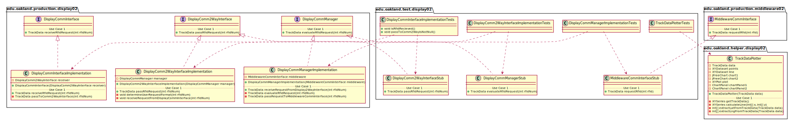

# UML Class Diagrams: Display_02 Subteam Packages

**Primary Owner:** Jessica Cortes, Display_02 Team SCRUM Master ([@jcortes18](https://github.com/jcortes18/))

**Secondary Owners:**

- Sydney Hill, Display_02 Team SCRUM Assistant Master ([@sydneyhill3901](https://github.com/sydneyhill3901/))
- Jonathan Chan, Display_02 Team SCRUM Integrator ([@Volter43](https://github.com/Volter43/))

## Purpose

This set of packages shall receive RFID tag from User and transmit the RFID number to the DisplayCommInterface class, DisplayComm2WayInterface class, DisplayCommManager class, then finally to MiddlewareCommInterface class . These classes will receive track data from Middleware and will transmit the track data back to the User.

## Packages

This subteam owns the following packages:

- [edu.oakland.production.display02](production)
- [edu.oakland.helper.display02](helper)
- [edu.oakland.test.display02](test)

## Class UML Diagram

Below is a diagram of the Display_02 Subteam packages themselves:

View larger as [.png](./Display02Packages.png) or [.svg](./Display02Packages.svg)

## Internal Dependencies UML Diagram

Below is a diagram of the internal dependencies within the Display_02 Subteam packages:

View larger as [.png](./Display02Packages_InternalDependencies.png) or [.svg](./Display02Packages_InternalDependencies.svg)

## Direct Dependencies UML Diagram

Below is a diagram of the direct dependencies required by the Display_02 Subteam packages:

View larger as [.png](./Display02Packages_DirectDependencies.png) or [.svg](./Display02Packages_DirectDependencies.svg)

## Complete Dependency Closure UML Diagram

Below is a diagram of the complete dependencies closure of the Display_02 Subteam packages:

View larger as [.png](./Display02Packages_Closure.png) or [.svg](./Display02Packages_Closure.svg)
