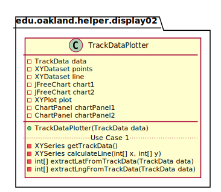

# UML Class Diagrams: edu.oakland.helper.display02

**Primary Owner:** Jessica Cortes, Display_02 Team SCRUM Master ([@jcortes18](https://github.com/jcortes18/))

**Secondary Owners:**

- Sydney Hill, Display_02 Team SCRUM Assistant Master ([@sydneyhill3901](https://github.com/sydneyhill3901/))
- Jonathan Chan, Display_02 Team SCRUM Integrator ([@Volter43](https://github.com/Volter43/))

## Purpose

This package shall display location data points in a scatter plot and a line representing the course direction.

## Intrerfaces

This package does not contain any interfaces.

## Classes

This package contains the following classes:

- [edu.oakland.helper.display02.TrackDataPlotter](TrackDataPlotter)

## Class UML Diagram

Below is a diagram of the edu.oakland.helper.display02 package itself:

View larger as [.png](./Display02HelperPackage.png) or [.svg](./Display02HelperPackage.svg)

## Internal Dependencies UML Diagram

Below is a diagram of the internal dependencies within the edu.oakland.helper.display02 package:

View larger as [.png](./Display02HelperPackage_InternalDependencies.png) or [.svg](./Display02HelperPackage_InternalDependencies.svg)

## Direct Dependencies UML Diagram

Below is a diagram of the direct dependencies required by the edu.oakland.helper.display02 package:

View larger as [.png](./Display02HelperPackage_DirectDependencies.png) or [.svg](./Display02HelperPackage_DirectDependencies.svg)

## Complete Dependency Closure UML Diagram

Below is a diagram of the complete dependencies closure of the edu.oakland.helper.display02 package:

View larger as [.png](./Display02HelperPackage_Closure.png) or [.svg](./Display02HelperPackage_Closure.svg)
