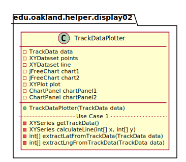

# UML Class Diagrams: edu.oakland.helper.display_02.TrackDataPlotter

**Primary Owner:** Jessica Cortes, Display_02 Team SCRUM Master ([@jcortes18](https://github.com/jcortes18/))

**Secondary Owners:**

- Sydney Hill, Display_02 Team SCRUM Assistant Master ([@sydneyhill3901](https://github.com/sydneyhill3901/))
- Jonathan Chan, Display_02 Team SCRUM Integrator ([@Volter43](https://github.com/Volter43/))

## Purpose

This class shall plot the TrackData for the user to visualize.

## Class UML Diagram

Below is a diagram of the TrackDataPlotter class itself:

View larger as [.png](./TrackDataPlotter.png) or [.svg](./TrackDataPlotter.svg)

## Direct Dependencies UML Diagram

Below is a diagram of the direct dependencies required by the TrackDataPlotter class:

View larger as [.png](./TrackDataPlotter_DirectDependencies.png) or [.svg](./TrackDataPlotter_DirectDependencies.svg)

## Complete Dependency Closure UML Diagram

Below is a diagram of the complete dependencies closure of the TrackDataPlotter class:

View larger as [.png](./TrackDataPlotter_Closure.png) or [.svg](./TrackDataPlotter_Closure.svg)
