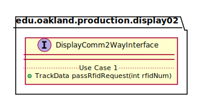

# UML Class Diagrams: edu.oakland.production.display02.DisplayComm2WayInterface

**Primary Owner:** Jessica Cortes, Display_02 Team SCRUM Master ([@jcortes18](https://github.com/jcortes18/))

**Secondary Owners:**

- Sydney Hill, Display_02 Team SCRUM Assistant Master ([@sydneyhill3901](https://github.com/sydneyhill3901/))
- Jonathan Chan, Display_02 Team SCRUM Integrator ([@Volter43](https://github.com/Volter43/))

## Purpose

This interface shall receive RFID tag from DisplayCommInterface interface, determine the user request format, and transmit RFID to DisplayComm2WayManager interface. This interface will receive track data from DisplayCommManager and will send the track data back to the DisplayCommInterface interface.

## Class UML Diagram

Below is a diagram of the DisplayComm2WayInterface interface itself:

View larger as [.png](./DisplayComm2WayInterface.png) or [.svg](./DisplayComm2WayInterface.svg)

## Direct Dependencies UML Diagram

Below is a diagram of the direct dependencies required by the DisplayComm2WayInterface interface:

View larger as [.png](./DisplayComm2WayInterface_DirectDependencies.png) or [.svg](./DisplayComm2WayInterface_DirectDependencies.svg)

## Complete Dependency Closure UML Diagram

Below is a diagram of the complete dependencies closure of the DisplayComm2WayInterface interface:

View larger as [.png](./DisplayComm2WayInterface_Closure.png) or [.svg](./DisplayComm2WayInterface_Closure.svg)
