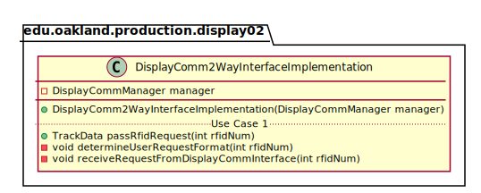
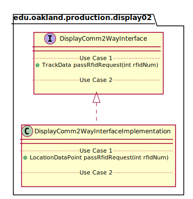
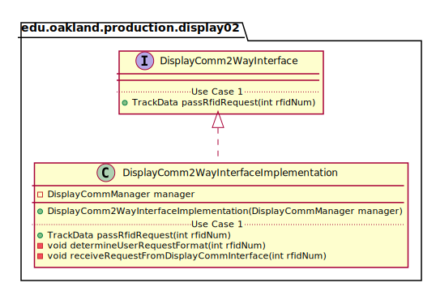

# UML Class Diagrams: edu.oakland.production.display02.DisplayComm2WayInterfaceImplementation

**Primary Owner:** Jessica Cortes, Display_02 Team SCRUM Master ([@jcortes18](https://github.com/jcortes18/))

**Secondary Owners:**

- Sydney Hill, Display_02 Team SCRUM Assistant Master ([@sydneyhill3901](https://github.com/sydneyhill3901/))
- Jonathan Chan, Display_02 Team SCRUM Integrator ([@Volter43](https://github.com/Volter43/))

## Purpose

This class shall receive RFID tag from DisplayCommInterface class, determine the user request format, and transmit RFID to DisplayComm2WayManager class. This class will receive track data from DisplayCommManager and will send the track data back to the DisplayCommInterface class. 

## Class UML Diagram

Below is a diagram of the DisplayComm2WayInterfaceImplementation class itself:

View larger as [.png](./DisplayComm2WayInterfaceImplementation.png) or [.svg](./DisplayComm2WayInterfaceImplementation.svg)

## Direct Dependencies UML Diagram

Below is a diagram of the direct dependencies required by the DisplayComm2WayInterfaceImplementation class:

View larger as [.png](./DisplayComm2WayInterfaceImplementation_DirectDependencies.png) or [.svg](./DisplayComm2WayInterfaceImplementation_DirectDependencies.svg)

## Complete Dependency Closure UML Diagram

Below is a diagram of the complete dependencies closure of the DisplayComm2WayInterfaceImplementation class:

View larger as [.png](./DisplayComm2WayInterfaceImplementation_Closure.png) or [.svg](./DisplayComm2WayInterfaceImplementation_Closure.svg)
