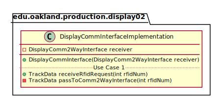
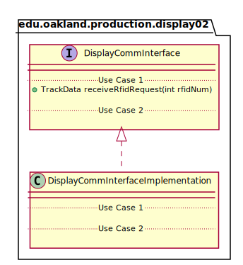
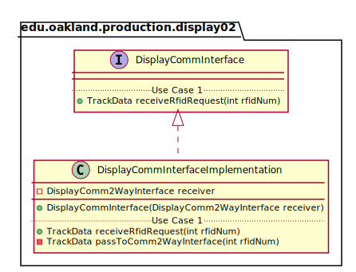

# UML Class Diagrams: edu.oakland.production.display02.DisplayCommInterfaceImplementation

**Primary Owner:** Jessica Cortes, Display_02 Team SCRUM Master ([@jcortes18](https://github.com/jcortes18/))

**Secondary Owners:**

- Sydney Hill, Display_02 Team SCRUM Assistant Master ([@sydneyhill3901](https://github.com/sydneyhill3901/))
- Jonathan Chan, Display_02 Team SCRUM Integrator ([@Volter43](https://github.com/Volter43/))

## Purpose

This class shall receive RFID tag from User and transmit RFID to DisplayComm2WayInterface Class. This class will receive track data from DisplayComm2WayInterface and will send the track data back to the User. 

## Class UML Diagram

Below is a diagram of the DisplayCommInterfaceImplementation class itself:

View larger as [.png](./DisplayCommInterfaceImplementation.png) or [.svg](./DisplayCommInterfaceImplementation.svg)

## Direct Dependencies UML Diagram

Below is a diagram of the direct dependencies required by the DisplayCommInterfaceImplementation class:

View larger as [.png](./DisplayCommInterfaceImplementation_DirectDependencies.png) or [.svg](./DisplayCommInterfaceImplementation_DirectDependencies.svg)

## Complete Dependency Closure UML Diagram

Below is a diagram of the complete dependencies closure of the DisplayCommInterfaceImplementation class:

View larger as [.png](./DisplayCommInterfaceImplementation_Closure.png) or [.svg](./DisplayCommInterfaceImplementation_Closure.svg)
