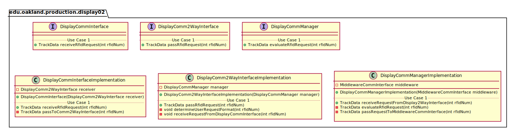
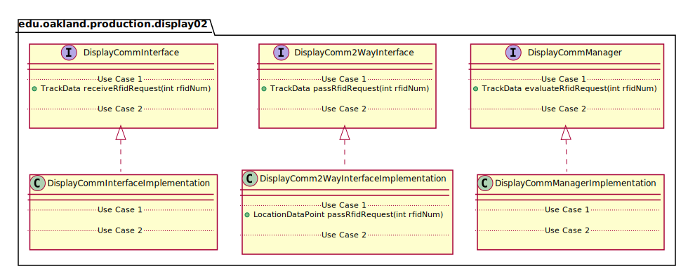
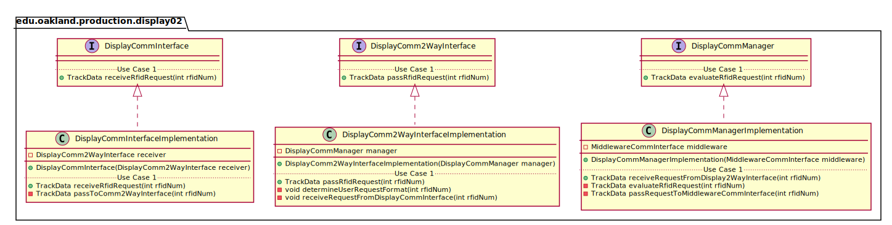

# UML Class Diagrams: edu.oakland.production.display02

**Primary Owner:** Jessica Cortes, Display_02 Team SCRUM Master ([@jcortes18](https://github.com/jcortes18/))

**Secondary Owners:**

- Sydney Hill, Display_02 Team SCRUM Assistant Master ([@sydneyhill3901](https://github.com/sydneyhill3901/))
- Jonathan Chan, Display_02 Team SCRUM Integrator ([@Volter43](https://github.com/Volter43/))

## Purpose

This package shall recieve an RFID tag from user and transmit the RFID number to MiddlewareCommInterface. This package will then receive track data from MiddlewareCommInterface and display the track data grid to the user.
## Interfaces

This package contains the following interfaces:

- [edu.oakland.production.display02.DisplayCommInterface](DisplayCommInterface)
- [edu.oakland.helper.display02.DisplayComm2WayInterface](DisplayComm2WayInterface)
- [edu.oakland.test.display02.DisplayCommManager](DisplayCommManager)

## Classes

This package contains the following classes:

- [edu.oakland.production.display02.DisplayCommInterfaceImplementation](DisplayCommInterfaceImplementation)
- [edu.oakland.helper.display02.DisplayComm2WayInterfaceImplementation](DisplayComm2WayInterfaceImplementation)
- [edu.oakland.test.display02.DisplayCommManagerImplementation](DisplayCommManagerImplementation)

## Class UML Diagram

Below is a diagram of the edu.oakland.production.display02 package itself:

View larger as [.png](./Display02ProductionPackage.png) or [.svg](./Display02ProductionPackage.svg)

## Internal Dependencies UML Diagram

Below is a diagram of the internal dependencies within the edu.oakland.production.display02 package:

View larger as [.png](./Display02ProductionPackage_InternalDependencies.png) or [.svg](./Display02ProductionPackage_InternalDependencies.svg)

## Direct Dependencies UML Diagram

Below is a diagram of the direct dependencies required by the edu.oakland.production.display02 package:

View larger as [.png](./Display02ProductionPackage_DirectDependencies.png) or [.svg](./Display02ProductionPackage_DirectDependencies.svg)

## Complete Dependency Closure UML Diagram

Below is a diagram of the complete dependencies closure of the edu.oakland.production.display02 package:

View larger as [.png](./Display02ProductionPackage_Closure.png) or [.svg](./Display02ProductionPackage_Closure.svg)
