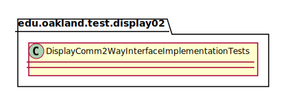
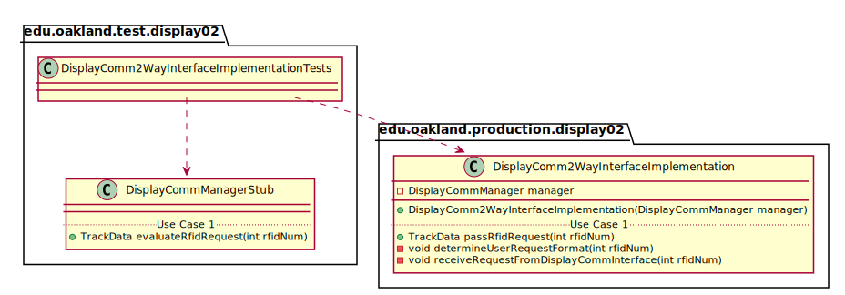
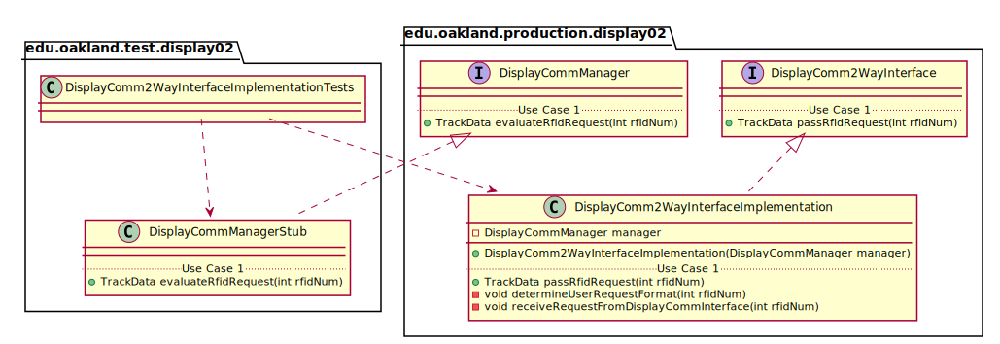

# UML Class Diagrams: edu.oakland.test.display02.DisplayComm2WayInterfaceImplementationTests

**Primary Owner:** Jessica Cortes, Display_02 Team SCRUM Master ([@jcortes18](https://github.com/jcortes18/))

**Secondary Owners:**

- Sydney Hill, Display_02 Team SCRUM Assistant Master ([@sydneyhill3901](https://github.com/sydneyhill3901/))
- Jonathan Chan, Display_02 Team SCRUM Integrator ([@Volter43](https://github.com/Volter43/))

## Purpose

This class shall run unit tests on the [edu.oakland.production.display02.DisplayComm2WayInterfaceImplementation](../../production/DisplayComm2WayInterfaceImplementation) class.

## Class UML Diagram

Below is a diagram of the DisplayComm2WayInterfaceImplementationTests interface itself:

View larger as [.png](./DisplayComm2WayInterfaceImplementationTests.png) or [.svg](./DisplayComm2WayInterfaceImplementationTests.svg)

## Direct Dependencies UML Diagram

Below is a diagram of the direct dependencies required by the DisplayComm2WayInterfaceImplementationTests interface:

View larger as [.png](./DisplayComm2WayInterfaceImplementationTests_DirectDependencies.png) or [.svg](./DisplayComm2WayInterfaceImplementationTests_DirectDependencies.svg)

## Complete Dependency Closure UML Diagram

Below is a diagram of the complete dependencies closure of the DisplayComm2WayInterfaceImplementationTests interface:

View larger as [.png](./DisplayComm2WayInterfaceImplementationTests_Closure.png) or [.svg](./DisplayComm2WayInterfaceImplementationTests_Closure.svg)
