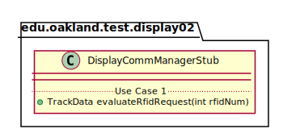
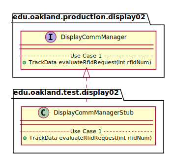

# UML Class Diagrams: edu.oakland.production.display02.DisplayCommManagerStub

**Primary Owner:** Jessica Cortes, Display_02 Team SCRUM Master ([@jcortes18](https://github.com/jcortes18/))

**Secondary Owners:**

- Sydney Hill, Display_02 Team SCRUM Assistant Master ([@sydneyhill3901](https://github.com/sydneyhill3901/))
- Jonathan Chan, Display_02 Team SCRUM Integrator ([@Volter43](https://github.com/Volter43/))

## Purpose

This class shall act as a stub of [edu.oakland.production.display02.DisplayCommManager](../../production/DisplayCommManager) for testing.

## Class UML Diagram

Below is a diagram of the DisplayCommManagerStub class itself:

View larger as [.png](./DisplayCommManagerStub.png) or [.svg](./DisplayCommManagerStub.svg)

## Direct Dependencies UML Diagram

Below is a diagram of the direct dependencies required by the DisplayCommManagerStub class:

View larger as [.png](./DisplayCommManagerStub_DirectDependencies.png) or [.svg](./DisplayCommManagerStub_DirectDependencies.svg)

## Complete Dependency Closure UML Diagram

Below is a diagram of the complete dependencies closure of the DisplayCommManagerStub class:

View larger as [.png](./DisplayCommManagerStub_Closure.png) or [.svg](./DisplayCommManagerStub_Closure.svg)
