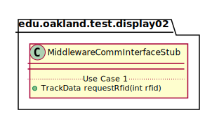
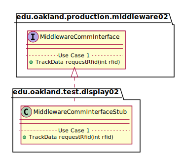

# UML Class Diagrams: edu.oakland.production.display02.MiddlewareCommInterfaceStub

**Primary Owner:** Jessica Cortes, Display_02 Team SCRUM Master ([@jcortes18](https://github.com/jcortes18/))

**Secondary Owners:**

- Sydney Hill, Display_02 Team SCRUM Assistant Master ([@sydneyhill3901](https://github.com/sydneyhill3901/))
- Jonathan Chan, Display_02 Team SCRUM Integrator ([@Volter43](https://github.com/Volter43/))

## Purpose

This class shall act as a stub of [edu.oakland.production.middleware02.MiddlewareCommInterface](../../../middleware02/production/MiddlewareCommInterface) for testing.

## Class UML Diagram

Below is a diagram of the MiddlewareCommInterfaceStub class itself:

View larger as [.png](./MiddlewareCommInterfaceStub.png) or [.svg](./MiddlewareCommInterfaceStub.svg)

## Direct Dependencies UML Diagram

Below is a diagram of the direct dependencies required by the MiddlewareCommInterfaceStub class:

View larger as [.png](./MiddlewareCommInterfaceStub_DirectDependencies.png) or [.svg](./MiddlewareCommInterfaceStub_DirectDependencies.svg)

## Complete Dependency Closure UML Diagram

Below is a diagram of the complete dependencies closure of the MiddlewareCommInterfaceStub class:

View larger as [.png](./MiddlewareCommInterfaceStub_Closure.png) or [.svg](./MiddlewareCommInterfaceStub_Closure.svg)
