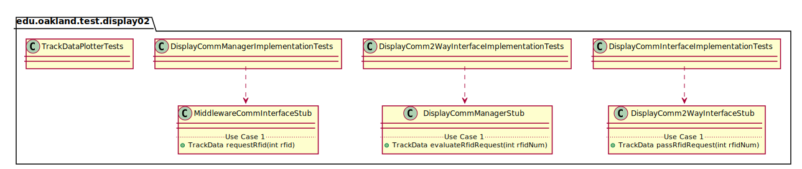
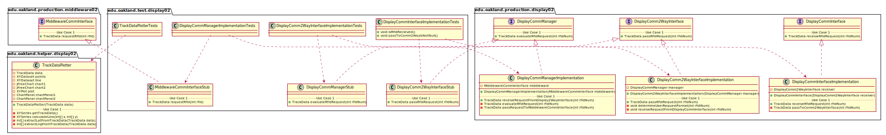

# UML Class Diagrams: edu.oakland.test.display02

**Primary Owner:** Jessica Cortes, Display_02 Team SCRUM Master ([@jcortes18](https://github.com/jcortes18/))

**Secondary Owners:**

- Sydney Hill, Display_02 Team SCRUM Assistant Master ([@sydneyhill3901](https://github.com/sydneyhill3901/))
- Jonathan Chan, Display_02 Team SCRUM Integrator ([@Volter43](https://github.com/Volter43/))

## Purpose

This package shall test whether the RFID tag is being transmitted to DisplayCommInterface, DisplayComm2WayInterface, DisplayCommManager, and MiddlewareCommInterface. This package shall also test whether TrackDataPlotter displays the charts correctly.

## Interfaces

This package does not contain any interfaces.

## Classes

### Unit Test Classes

This package contains the following unit test classes:

- [edu.oakland.test.display02.DisplayCommInterfaceImplementationTests](DisplayCommInterfaceImplementationTests)
- [edu.oakland.test.display02.DisplayComm2WayInterfaceImplementationTests](DisplayComm2WayInterfaceImplementationTests)
- [edu.oakland.test.display02.DisplayCommManagerImplementationTests](DisplayCommManagerImplementationTests)
- [edu.oakland.test.display02.TrackDataPlotterTests](TrackDataPlotterTests)

## Test Stub Classes

This package contains the following unit test classes:

- [edu.oakland.test.display02.DisplayComm2WayInterfaceStub](DisplayComm2WayInterfaceStub)
- [edu.oakland.test.display02.DisplayCommManagerStub](DisplayCommManagerStub)
- [edu.oakland.test.display02.MiddlewareCommInterfaceStub](MiddlewareCommInterfaceStub)

## Class UML Diagram

Below is a diagram of the edu.oakland.test.display02 package itself:

View larger as [.png](./Display02TestPackage.png) or [.svg](./Display02TestPackage.svg)

## Internal Dependencies UML Diagram

Below is a diagram of the internal dependencies within the edu.oakland.test.display02 package:

View larger as [.png](./Display02TestPackage_InternalDependencies.png) or [.svg](./Display02TestPackage_InternalDependencies.svg)

## Direct Dependencies UML Diagram

Below is a diagram of the direct dependencies required by the edu.oakland.test.display02 package:

View larger as [.png](./Display02TestPackage_DirectDependencies.png) or [.svg](./Display02TestPackage_DirectDependencies.svg)

## Complete Dependency Closure UML Diagram

Below is a diagram of the complete dependencies closure of the edu.oakland.test.display02 package:

View larger as [.png](./Display02TestPackage_Closure.png) or [.svg](./Display02TestPackage_Closure.svg)
