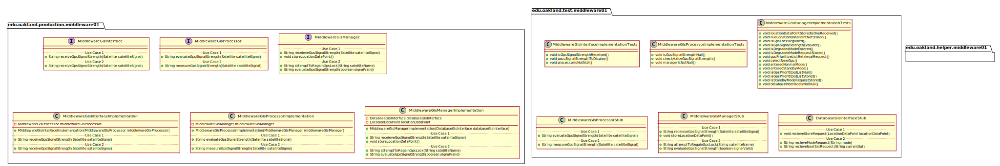
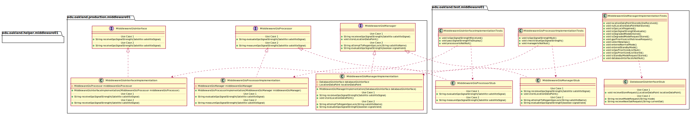
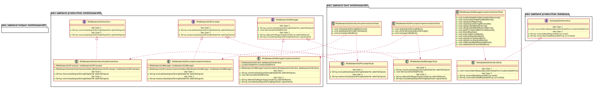

# UML Class Diagrams: Middleware_01 Subteam Packages

**Primary Owner:** Brenda Morquecho, Middleware_01 Team SCRUM Master ([@brendam19](https://github.com/brendam19/))

**Secondary Owners:**

- Julia Wang, Middleware_01 Team SCRUM Assistant Master ([@juliawang2014](https://github.com/juliawang2014/))
- Martin Hughes, Middleware_01 Team SCRUM Integrator ([@martinhughes0722](https://github.com/martinhughes0722/))

## Purpose

This set of packages shall recieve gps signals from display and pass them to database.

## Packages

This subteam owns the following packages:

- [edu.oakland.production.middleware01](production)
- [edu.oakland.helper.middleware01](helper)
- [edu.oakland.test.middleware01](test)

## Class UML Diagram

Below is a diagram of the Middleware_01 Subteam packages themselves:

View larger as [.png](./Middleware01Packages.png) or [.svg](./Middleware01Packages.svg)

## Internal Dependencies UML Diagram

Below is a diagram of the internal dependencies within the Middleware_01 Subteam packages:

View larger as [.png](./Middleware01Packages_InternalDependencies.png) or [.svg](./Middleware01Packages_InternalDependencies.svg)

## Direct Dependencies UML Diagram

Below is a diagram of the direct dependencies required by the Middleware_01 Subteam packages:

View larger as [.png](./Middleware01Packages_DirectDependencies.png) or [.svg](./Middleware01Packages_DirectDependencies.svg)

## Complete Dependency Closure UML Diagram

Below is a diagram of the complete dependencies closure of the Middleware_01 Subteam packages:

View larger as [.png](./Middleware01Packages_Closure.png) or [.svg](./Middleware01Packages_Closure.svg)
