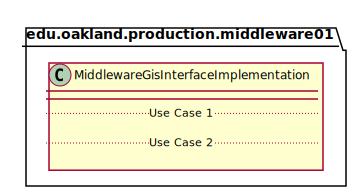
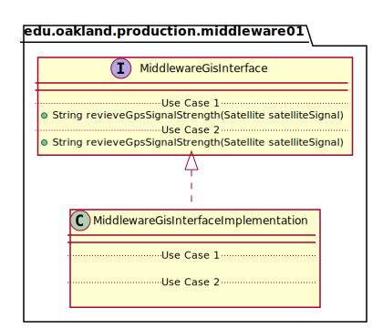
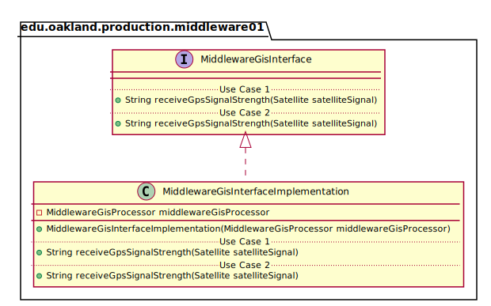

# UML Class Diagrams: edu.oakland.production.middleware01.MiddlewareGisInterfaceImplementation

**Primary Owner:** Brenda Morquecho, Middleware_01 Team SCRUM Master ([@brendam19](https://github.com/brendam19/))

**Secondary Owners:**

- Julia Wang, Middleware_01 Team SCRUM Assistant Master ([@juliawang2014](https://github.com/juliawang2014/))
- Martin Hughes, Middleware_01 Team SCRUM Integrator ([@martinhughes0722](https://github.com/martinhughes0722/))

## Purpose

This class shall recieve that GPS signal from display and pass it to GIS processor.

## Class UML Diagram

Below is a diagram of the MiddlewareGisInterfaceImplementation class itself:

View larger as [.png](./MiddlewareGisInterfaceImplementation.png) or [.svg](./MiddlewareGisInterfaceImplementation.svg)

## Direct Dependencies UML Diagram

Below is a diagram of the direct dependencies required by the MiddlewareGisInterfaceImplementation class:

View larger as [.png](./MiddlewareGisInterfaceImplementation_DirectDependencies.png) or [.svg](./MiddlewareGisInterfaceImplementation_DirectDependencies.svg)

## Complete Dependency Closure UML Diagram

Below is a diagram of the complete dependencies closure of the MiddlewareGisInterfaceImplementation class:

View larger as [.png](./MiddlewareGisInterfaceImplementation_Closure.png) or [.svg](./MiddlewareGisInterfaceImplementation_Closure.svg)
