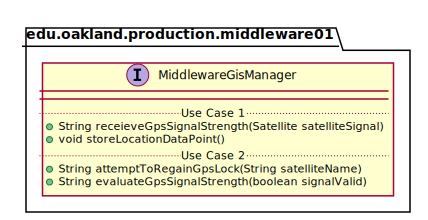

# UML Class Diagrams: edu.oakland.production.middleware01.MiddlewareGisManager

**Primary Owner:** Brenda Morquecho, Middleware_01 Team SCRUM Master ([@brendam19](https://github.com/brendam19/))

**Secondary Owners:**

- Julia Wang, Middleware_01 Team SCRUM Assistant Master ([@juliawang2014](https://github.com/juliawang2014/))
- Martin Hughes, Middleware_01 Team SCRUM Integrator ([@martinhughes0722](https://github.com/martinhughes0722/))

## Purpose

This manager shall recieve and evaluate the GPS signal strength, attempt regaining the GPS lock if needed, and store location data points.

## Class UML Diagram

Below is a diagram of the MiddlewareGisManager manager itself:

View larger as [.png](./MiddlewareGisManager.png) or [.svg](./MiddlewareGisManager.svg)

## Direct Dependencies UML Diagram

Below is a diagram of the direct dependencies required by the MiddlewareGisManager manager:

View larger as [.png](./MiddlewareGisManager_DirectDependencies.png) or [.svg](./MiddlewareGisManager_DirectDependencies.svg)

## Complete Dependency Closure UML Diagram

Below is a diagram of the complete dependencies closure of the MiddlewareGisManager manager:

View larger as [.png](./MiddlewareGisManager_Closure.png) or [.svg](./MiddlewareGisManager_Closure.svg)
