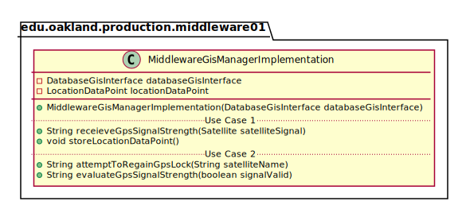
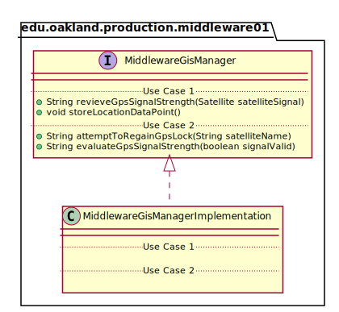
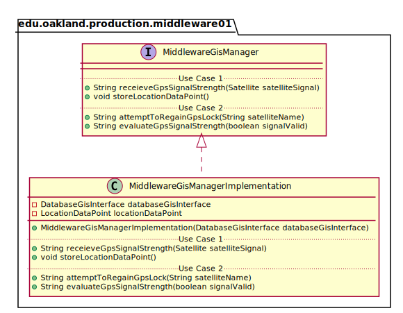

# UML Class Diagrams: edu.oakland.production.middleware01.MiddlewareGisManagerImplementation

**Primary Owner:** Brenda Morquecho, Middleware_01 Team SCRUM Master ([@brendam19](https://github.com/brendam19/))

**Secondary Owners:**

- Julia Wang, Middleware_01 Team SCRUM Assistant Master ([@juliawang2014](https://github.com/juliawang2014/))
- Martin Hughes, Middleware_01 Team SCRUM Integrator ([@martinhughes0722](https://github.com/martinhughes0722/))

## Purpose

This class shall receive the Satellite signal, store the data point and pass the signal to the database or attempt to regain GPS lock and evaluate the signal strength.

## Class UML Diagram

Below is a diagram of the MiddlewareGisManagerImplementation class itself:

View larger as [.png](./MiddlewareGisManagerImplementation.png) or [.svg](./MiddlewareGisManagerImplementation.svg)

## Direct Dependencies UML Diagram

Below is a diagram of the direct dependencies required by the MiddlewareGisManagerImplementation class:

View larger as [.png](./MiddlewareGisManagerImplementation_DirectDependencies.png) or [.svg](./MiddlewareGisManagerImplementation_DirectDependencies.svg)

## Complete Dependency Closure UML Diagram

Below is a diagram of the complete dependencies closure of the MiddlewareGisManagerImplementation class:

View larger as [.png](./MiddlewareGisManagerImplementation_Closure.png) or [.svg](./MiddlewareGisManagerImplementation_Closure.svg)
