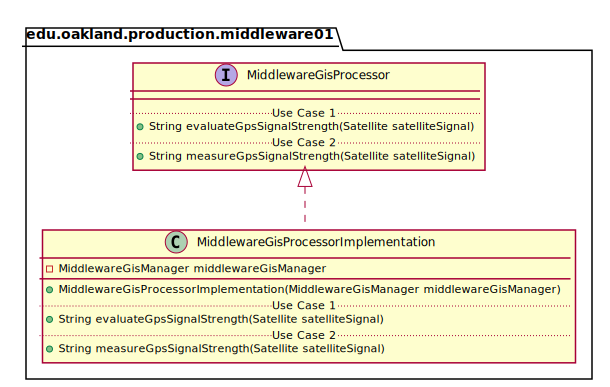

# UML Class Diagrams: edu.oakland.production.middleware01.MiddlewareGisProcessorImplementation

**Primary Owner:** Brenda Morquecho, Middleware_01 Team SCRUM Master ([@brendam19](https://github.com/brendam19/))

**Secondary Owners:**

- Julia Wang, Middleware_01 Team SCRUM Assistant Master ([@juliawang2014](https://github.com/juliawang2014/))
- Martin Hughes, Middleware_01 Team SCRUM Integrator ([@martinhughes0722](https://github.com/martinhughes0722/))

## Purpose

This class shall evaluate and measure the Satellite Signal strength passed in from the MiddlewareGisInterface.

## Class UML Diagram

Below is a diagram of the MiddlewareGisProcessorImplementation class itself:

View larger as [.png](./MiddlewareGisProcessorImplementation.png) or [.svg](./MiddlewareGisProcessorImplementation.svg)

## Direct Dependencies UML Diagram

Below is a diagram of the direct dependencies required by the MiddlewareGisProcessorImplementation class:

View larger as [.png](./MiddlewareGisProcessorImplementation_DirectDependencies.png) or [.svg](./MiddlewareGisProcessorImplementation_DirectDependencies.svg)

## Complete Dependency Closure UML Diagram

Below is a diagram of the complete dependencies closure of the MiddlewareGisProcessorImplementation class:

View larger as [.png](./MiddlewareGisProcessorImplementation_Closure.png) or [.svg](./MiddlewareGisProcessorImplementation_Closure.svg)
