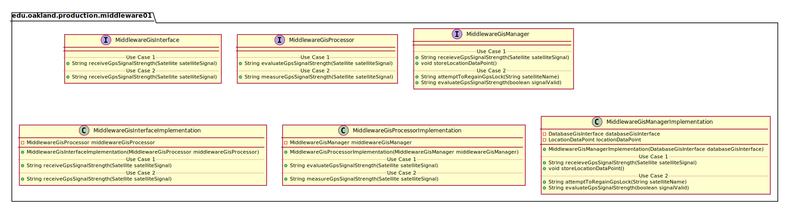
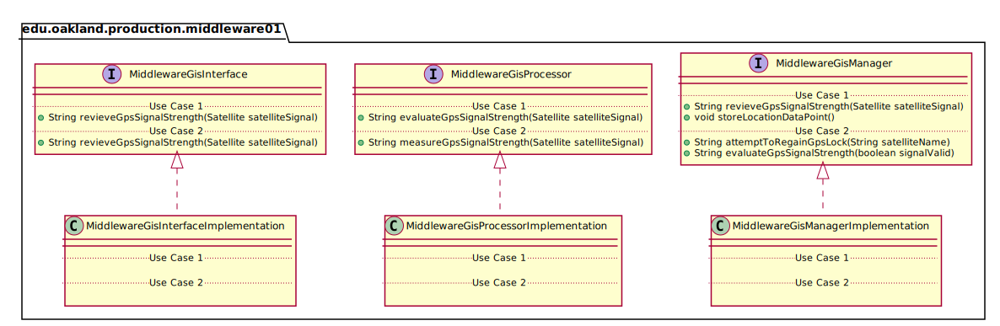
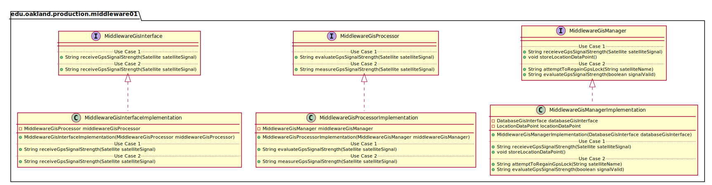

# UML Class Diagrams: edu.oakland.production.middleware01

**Primary Owner:** Brenda Morquecho, Middleware_01 Team SCRUM Master ([@brendam19](https://github.com/brendam19/))

**Secondary Owners:**

- Julia Wang, Middleware_01 Team SCRUM Assistant Master ([@juliawang2014](https://github.com/juliawang2014/))
- Martin Hughes, Middleware_01 Team SCRUM Integrator ([@martinhughes0722](https://github.com/martinhughes0722/))

## Purpose

This package shall recieve a gps signal from display and check its strength before passing to database.

## Intrerfaces

This package contains the following interfaces:

- [edu.oakland.production.middleware01.MiddlewareGisInterface](MiddlewareGisInterface)
- [edu.oakland.helper.middleware01.MiddlewareGisProcessor](MiddlewareGisProcessor)
- [edu.oakland.test.middleware01.MiddlewareGisManager](MiddlewareGisManager)

## Classes

This package contains the following classes:

- [edu.oakland.production.middleware01.MiddlewareGisInterfaceImplementation](MiddlewareGisInterfaceImplementation)
- [edu.oakland.helper.middleware01.MiddlewareGisProcessorImplementation](MiddlewareGisProcessorImplementation)
- [edu.oakland.test.middleware01.MiddlewareGisManagerImplementation](MiddlewareGisManagerImplementation)

## Class UML Diagram

Below is a diagram of the edu.oakland.production.middleware01 package itself:

View larger as [.png](./Middleware01ProductionPackage.png) or [.svg](./Middleware01ProductionPackage.svg)

## Internal Dependencies UML Diagram

Below is a diagram of the internal dependencies within the edu.oakland.production.middleware01 package:

View larger as [.png](./Middleware01ProductionPackage_InternalDependencies.png) or [.svg](./Middleware01ProductionPackage_InternalDependencies.svg)

## Direct Dependencies UML Diagram

Below is a diagram of the direct dependencies required by the edu.oakland.production.middleware01 package:

View larger as [.png](./Middleware01ProductionPackage_DirectDependencies.png) or [.svg](./Middleware01ProductionPackage_DirectDependencies.svg)

## Complete Dependency Closure UML Diagram

Below is a diagram of the complete dependencies closure of the edu.oakland.production.middleware01 package:

View larger as [.png](./Middleware01ProductionPackage_Closure.png) or [.svg](./Middleware01ProductionPackage_Closure.svg)
