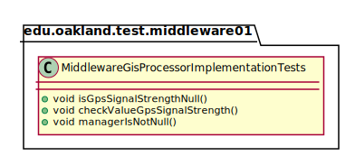
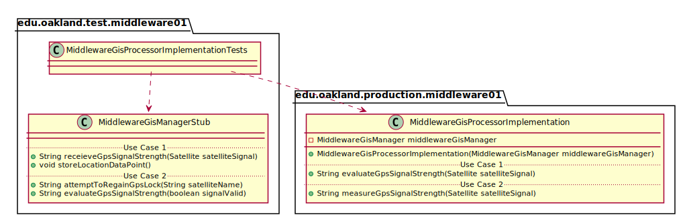
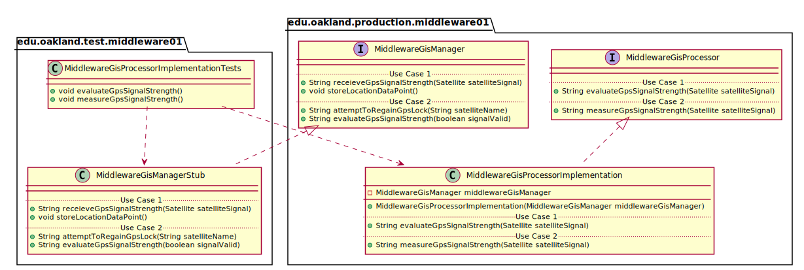

# UML Class Diagrams: edu.oakland.test.middleware01.MiddlewareGisProcessorImplementationTests

**Primary Owner:** Brenda Morquecho, Middleware_01 Team SCRUM Master ([@brendam19](https://github.com/brendam19/))

**Secondary Owners:**

- Julia Wang, Middleware_01 Team SCRUM Assistant Master ([@juliawang2014](https://github.com/juliawang2014/))
- Martin Hughes, Middleware_01 Team SCRUM Integrator ([@martinhughes0722](https://github.com/martinhughes0722/))

## Purpose

This class shall run unit tests on the [edu.oakland.production.middleware01.MiddlewareGisProcessorImplementation](../../production/MiddlewareGisProcessorImplementation) class.

## Class UML Diagram

Below is a diagram of the MiddlewareGisProcessorImplementationTests interface itself:

View larger as [.png](./MiddlewareGisProcessorImplementationTests.png) or [.svg](./MiddlewareGisProcessorImplementationTests.svg)

## Direct Dependencies UML Diagram

Below is a diagram of the direct dependencies required by the MiddlewareGisProcessorImplementationTests interface:

View larger as [.png](./MiddlewareGisProcessorImplementationTests_DirectDependencies.png) or [.svg](./MiddlewareGisProcessorImplementationTests_DirectDependencies.svg)

## Complete Dependency Closure UML Diagram

Below is a diagram of the complete dependencies closure of the MiddlewareGisProcessorImplementationTests interface:

View larger as [.png](./MiddlewareGisProcessorImplementationTests_Closure.png) or [.svg](./MiddlewareGisProcessorImplementationTests_Closure.svg)
