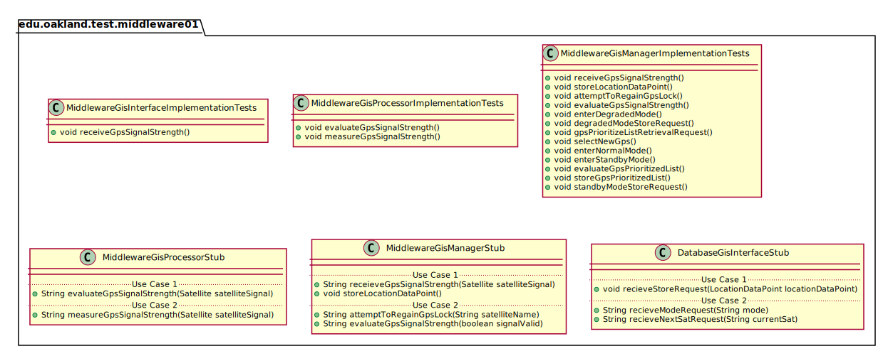
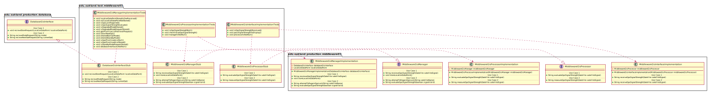
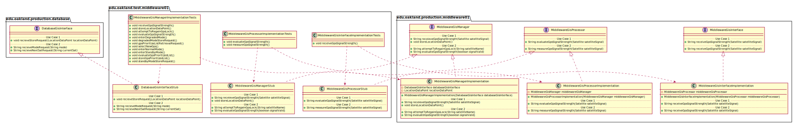

# UML Class Diagrams: edu.oakland.test.middleware01

**Primary Owner:** Brenda Morquecho, Middleware_01 Team SCRUM Master ([@brendam19](https://github.com/brendam19/))

**Secondary Owners:**

- Julia Wang, Middleware_01 Team SCRUM Assistant Master ([@juliawang2014](https://github.com/juliawang2014/))
- Martin Hughes, Middleware_01 Team SCRUM Integrator ([@martinhughes0722](https://github.com/martinhughes0722/))

## Purpose

This package shall contain JUnit test classes to validate production code.

## Intrerfaces

This package does not contain any interfaces.

## Classes

### Unit Test Classes

This package contains the following unit test classes:

- [edu.oakland.test.middleware01.MiddlewareGisInterfaceImplementationTests](MiddlewareGisInterfaceImplementationTests)
- [edu.oakland.test.middleware01.MiddlewareGisProcessorImplementationTests](MiddlewareGisProcessorImplementationTests)
- [edu.oakland.test.middleware01.MiddlewareGisManagerImplementationTests](MiddlewareGisManagerImplementationTests)

## Test Stub Classes

This package contains the following unit test classes:

- [edu.oakland.test.middleware01.MiddlewareGisProcessorStub](MiddlewareGisProcessorStub)
- [edu.oakland.test.middleware01.MiddlewareGisManagerStub](MiddlewareGisManagerStub)
- [edu.oakland.test.middleware01.DatabaseGisInterfaceStub](DatabaseGisInterfaceStub)

## Class UML Diagram

Below is a diagram of the edu.oakland.test.middleware01 package itself:

View larger as [.png](./Middleware01TestPackage.png) or [.svg](./Middleware01TestPackage.svg)

## Internal Dependencies UML Diagram

Below is a diagram of the internal dependencies within the edu.oakland.test.middleware01 package:

View larger as [.png](./Middleware01TestPackage_InternalDependencies.png) or [.svg](./Middleware01TestPackage_InternalDependencies.svg)

## Direct Dependencies UML Diagram

Below is a diagram of the direct dependencies required by the edu.oakland.test.middleware01 package:

View larger as [.png](./Middleware01TestPackage_DirectDependencies.png) or [.svg](./Middleware01TestPackage_DirectDependencies.svg)

## Complete Dependency Closure UML Diagram

Below is a diagram of the complete dependencies closure of the edu.oakland.test.middleware01 package:

View larger as [.png](./Middleware01TestPackage_Closure.png) or [.svg](./Middleware01TestPackage_Closure.svg)
