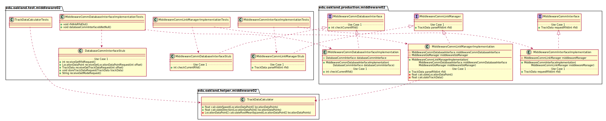
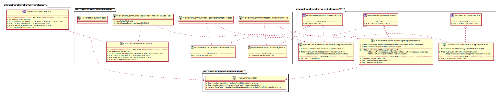

# UML Class Diagrams: Middleware_02 Subteam Packages

**Primary Owner:** Kenzie King, Middleware_02 Team SCRUM Master ([@mckenzieking](https://github.com/mckenzieking/))

**Secondary Owners:**

- Kal Willard, Middleware_02 Team SCRUM Assistant Master ([@kwillard34](https://github.com/kwillard34/))
- Rio Capollari, Middleware_02 Team SCRUM Integrator ([@rcapollari](https://github.com/rcapollari/))

## Purpose

This set of packages shall calculate location and verify proper RFID.

## Packages

This subteam owns the following packages:

- [edu.oakland.production.middleware02](production)
- [edu.oakland.helper.middleware02](helper)
- [edu.oakland.test.middleware02](test)

## Class UML Diagram

Below is a diagram of the Middleware_02 Subteam packages themselves:

View larger as [.png](./Middleware02Packages.png) or [.svg](./Middleware02Packages.svg)

## Internal Dependencies UML Diagram

Below is a diagram of the internal dependencies within the Middleware_02 Subteam packages:

View larger as [.png](./Middleware02Packages_InternalDependencies.png) or [.svg](./Middleware02Packages_InternalDependencies.svg)

## Direct Dependencies UML Diagram

Below is a diagram of the direct dependencies required by the Middleware_02 Subteam packages:

View larger as [.png](./Middleware02Packages_DirectDependencies.png) or [.svg](./Middleware02Packages_DirectDependencies.svg)

## Complete Dependency Closure UML Diagram

Below is a diagram of the complete dependencies closure of the Middleware_02 Subteam packages:

View larger as [.png](./Middleware02Packages_Closure.png) or [.svg](./Middleware02Packages_Closure.svg)
