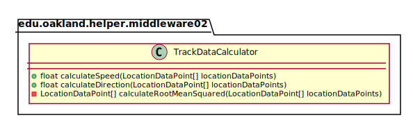

# UML Class Diagrams: edu.oakland.helper.middleware02.TrackDataCalculator

**Primary Owner:** Kenzie King, Middleware_02 Team SCRUM Master ([@mckenzieking](https://github.com/mckenzieking/))

**Secondary Owners:**

- Kal Willard, Middleware_02 Team SCRUM Assistant Master ([@kwillard34](https://github.com/kwillard34/))
- Rio Capollari, Middleware_02 Team SCRUM Integrator ([@rcapollari](https://github.com/rcapollari/))

## Purpose

This class shall calculate the speed and direction of the container based on a set of LocationDataPoints.

## Class UML Diagram

Below is a diagram of the TrackDataCalculator class itself:

View larger as [.png](./TrackDataCalculator.png) or [.svg](./TrackDataCalculator.svg)

## Direct Dependencies UML Diagram

Below is a diagram of the direct dependencies required by the TrackDataCalculator class:

View larger as [.png](./TrackDataCalculator_DirectDependencies.png) or [.svg](./TrackDataCalculator_DirectDependencies.svg)

## Complete Dependency Closure UML Diagram

Below is a diagram of the complete dependencies closure of the TrackDataCalculator class:

View larger as [.png](./TrackDataCalculator_Closure.png) or [.svg](./TrackDataCalculator_Closure.svg)
