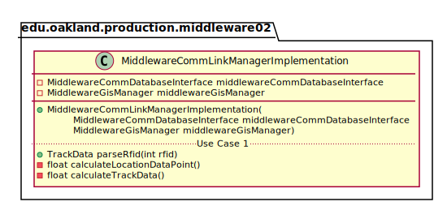
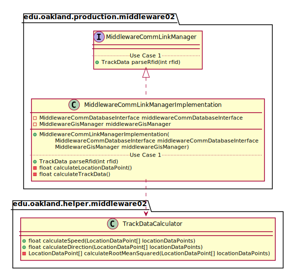

# UML Class Diagrams: edu.oakland.production.middleware02.MiddlewareCommLinkManagerImplementation

**Primary Owner:** Kenzie King, Middleware_02 Team SCRUM Master ([@mckenzieking](https://github.com/mckenzieking/))

**Secondary Owners:**

- Kal Willard, Middleware_02 Team SCRUM Assistant Master ([@kwillard34](https://github.com/kwillard34/))
- Rio Capollari, Middleware_02 Team SCRUM Integrator ([@rcapollari](https://github.com/rcapollari/))

## Purpose

This class shall calculate location.

## Class UML Diagram

Below is a diagram of the MiddlewareCommLinkManagerImplementation class itself:

View larger as [.png](./MiddlewareCommLinkManagerImplementation.png) or [.svg](./MiddlewareCommLinkManagerImplementation.svg)

## Direct Dependencies UML Diagram

Below is a diagram of the direct dependencies required by the MiddlewareCommLinkManagerImplementation class:

View larger as [.png](./MiddlewareCommLinkManagerImplementation_DirectDependencies.png) or [.svg](./MiddlewareCommLinkManagerImplementation_DirectDependencies.svg)

## Complete Dependency Closure UML Diagram

Below is a diagram of the complete dependencies closure of the MiddlewareCommLinkManagerImplementation class:

View larger as [.png](./MiddlewareCommLinkManagerImplementation_Closure.png) or [.svg](./MiddlewareCommLinkManagerImplementation_Closure.svg)
