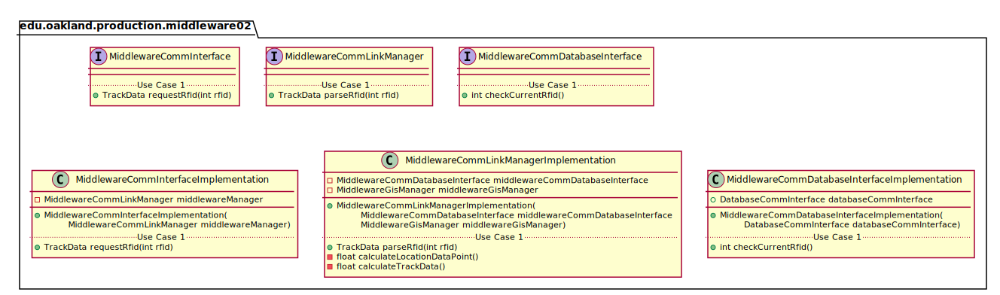
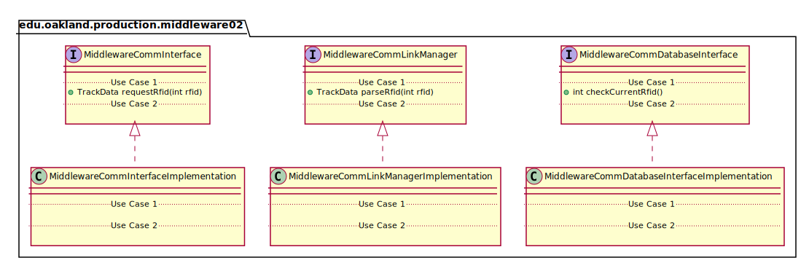
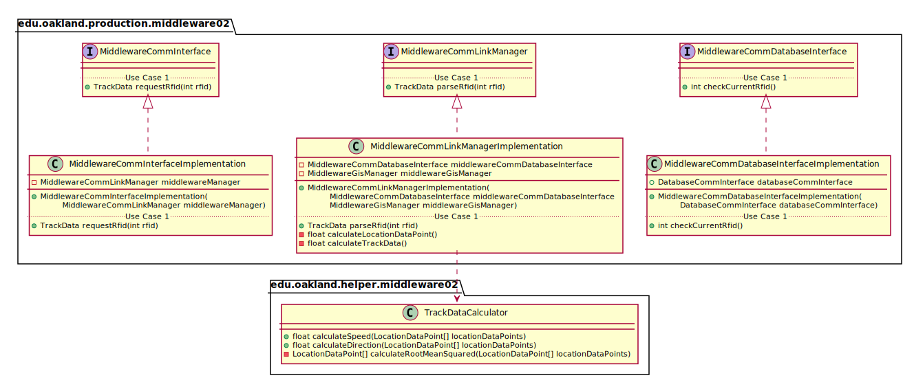

# UML Class Diagrams: edu.oakland.production.middleware02

**Primary Owner:** Kenzie King, Middleware_02 Team SCRUM Master ([@mckenzieking](https://github.com/mckenzieking/))

**Secondary Owners:**

- Kal Willard, Middleware_02 Team SCRUM Assistant Master ([@kwillard34](https://github.com/kwillard34/))
- Rio Capollari, Middleware_02 Team SCRUM Integrator ([@rcapollari](https://github.com/rcapollari/))

## Purpose

This package shall house our production code for calculation of location tracking and verification of RFID.

## Intrerfaces

This package contains the following interfaces:

- [edu.oakland.production.middleware02.MiddlewareCommInterface](MiddlewareCommInterface)
- [edu.oakland.helper.middleware02.MiddlewareCommLinkManager](MiddlewareCommLinkManager)
- [edu.oakland.test.middleware02.MiddlewareCommDatabaseInterface](MiddlewareCommDatabaseInterface)

## Classes

This package contains the following classes:

- [edu.oakland.production.middleware02.MiddlewareCommInterfaceImplementation](MiddlewareCommInterfaceImplementation)
- [edu.oakland.helper.middleware02.MiddlewareCommLinkManagerImplementation](MiddlewareCommLinkManagerImplementation)
- [edu.oakland.test.middleware02.MiddlewareCommDatabaseInterfaceImplementation](MiddlewareCommDatabaseInterfaceImplementation)

## Class UML Diagram

Below is a diagram of the edu.oakland.production.middleware02 package itself:

View larger as [.png](./Middleware02ProductionPackage.png) or [.svg](./Middleware02ProductionPackage.svg)

## Internal Dependencies UML Diagram

Below is a diagram of the internal dependencies within the edu.oakland.production.middleware02 package:

View larger as [.png](./Middleware02ProductionPackage_InternalDependencies.png) or [.svg](./Middleware02ProductionPackage_InternalDependencies.svg)

## Direct Dependencies UML Diagram

Below is a diagram of the direct dependencies required by the edu.oakland.production.middleware02 package:

View larger as [.png](./Middleware02ProductionPackage_DirectDependencies.png) or [.svg](./Middleware02ProductionPackage_DirectDependencies.svg)

## Complete Dependency Closure UML Diagram

Below is a diagram of the complete dependencies closure of the edu.oakland.production.middleware02 package:

View larger as [.png](./Middleware02ProductionPackage_Closure.png) or [.svg](./Middleware02ProductionPackage_Closure.svg)
