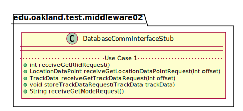
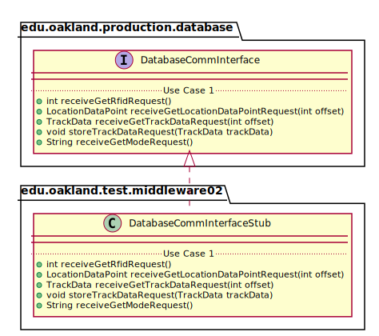

# UML Class Diagrams: edu.oakland.production.middleware02.DatabaseCommInterfaceStub

**Primary Owner:** Kenzie King, Middleware_02 Team SCRUM Master ([@mckenzieking](https://github.com/mckenzieking/))

**Secondary Owners:**

- Kal Willard, Middleware_02 Team SCRUM Assistant Master ([@kwillard34](https://github.com/kwillard34/))
- Rio Capollari, Middleware_02 Team SCRUM Integrator ([@rcapollari](https://github.com/rcapollari/))

## Purpose

This class shall act as a stub of [edu.oakland.production.database.DatabaseCommInterface](../../../database/production/DatabaseCommInterface) for testing.

## Class UML Diagram

Below is a diagram of the DatabaseCommInterfaceStub class itself:

View larger as [.png](./DatabaseCommInterfaceStub.png) or [.svg](./DatabaseCommInterfaceStub.svg)

## Direct Dependencies UML Diagram

Below is a diagram of the direct dependencies required by the DatabaseCommInterfaceStub class:

View larger as [.png](./DatabaseCommInterfaceStub_DirectDependencies.png) or [.svg](./DatabaseCommInterfaceStub_DirectDependencies.svg)

## Complete Dependency Closure UML Diagram

Below is a diagram of the complete dependencies closure of the DatabaseCommInterfaceStub class:

View larger as [.png](./DatabaseCommInterfaceStub_Closure.png) or [.svg](./DatabaseCommInterfaceStub_Closure.svg)
