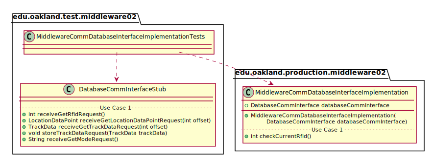
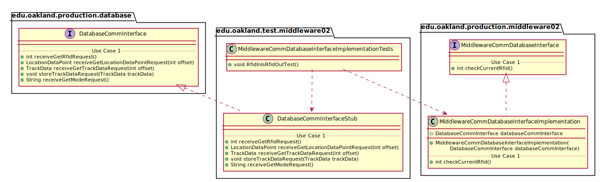

# UML Class Diagrams: edu.oakland.test.middleware02.MiddlewareCommDatabaseInterfaceImplementationTests

**Primary Owner:** Kenzie King, Middleware_02 Team SCRUM Master ([@mckenzieking](https://github.com/mckenzieking/))

**Secondary Owners:**

- Kal Willard, Middleware_02 Team SCRUM Assistant Master ([@kwillard34](https://github.com/kwillard34/))
- Rio Capollari, Middleware_02 Team SCRUM Integrator ([@rcapollari](https://github.com/rcapollari/))

## Purpose

This class shall run unit tests on the [edu.oakland.production.middleware02.MiddlewareCommDatabaseInterfaceImplementation](../../production/MiddlewareCommDatabaseInterfaceImplementation) class.

## Class UML Diagram

Below is a diagram of the MiddlewareCommDatabaseInterfaceImplementationTests interface itself:

View larger as [.png](./MiddlewareCommDatabaseInterfaceImplementationTests.png) or [.svg](./MiddlewareCommDatabaseInterfaceImplementationTests.svg)

## Direct Dependencies UML Diagram

Below is a diagram of the direct dependencies required by the MiddlewareCommDatabaseInterfaceImplementationTests interface:

View larger as [.png](./MiddlewareCommDatabaseInterfaceImplementationTests_DirectDependencies.png) or [.svg](./MiddlewareCommDatabaseInterfaceImplementationTests_DirectDependencies.svg)

## Complete Dependency Closure UML Diagram

Below is a diagram of the complete dependencies closure of the MiddlewareCommDatabaseInterfaceImplementationTests interface:

View larger as [.png](./MiddlewareCommDatabaseInterfaceImplementationTests_Closure.png) or [.svg](./MiddlewareCommDatabaseInterfaceImplementationTests_Closure.svg)
