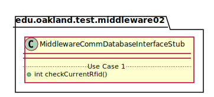
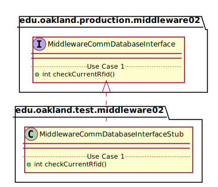

# UML Class Diagrams: edu.oakland.production.middleware02.MiddlewareCommDatabaseInterfaceStub

**Primary Owner:** Kenzie King, Middleware_02 Team SCRUM Master ([@mckenzieking](https://github.com/mckenzieking/))

**Secondary Owners:**

- Kal Willard, Middleware_02 Team SCRUM Assistant Master ([@kwillard34](https://github.com/kwillard34/))
- Rio Capollari, Middleware_02 Team SCRUM Integrator ([@rcapollari](https://github.com/rcapollari/))

## Purpose

This class shall act as a stub of [edu.oakland.production.middleware02.MiddlewareCommDatabaseInterface](../../production/MiddlewareCommDatabaseInterface) for testing.

## Class UML Diagram

Below is a diagram of the MiddlewareCommDatabaseInterfaceStub class itself:

View larger as [.png](./MiddlewareCommDatabaseInterfaceStub.png) or [.svg](./MiddlewareCommDatabaseInterfaceStub.svg)

## Direct Dependencies UML Diagram

Below is a diagram of the direct dependencies required by the MiddlewareCommDatabaseInterfaceStub class:

View larger as [.png](./MiddlewareCommDatabaseInterfaceStub_DirectDependencies.png) or [.svg](./MiddlewareCommDatabaseInterfaceStub_DirectDependencies.svg)

## Complete Dependency Closure UML Diagram

Below is a diagram of the complete dependencies closure of the MiddlewareCommDatabaseInterfaceStub class:

View larger as [.png](./MiddlewareCommDatabaseInterfaceStub_Closure.png) or [.svg](./MiddlewareCommDatabaseInterfaceStub_Closure.svg)
