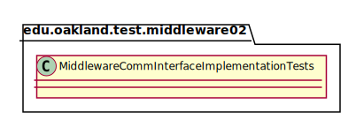
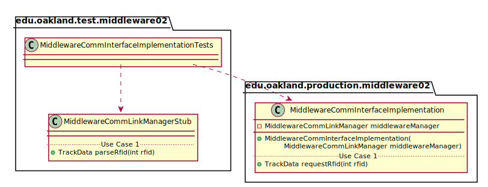
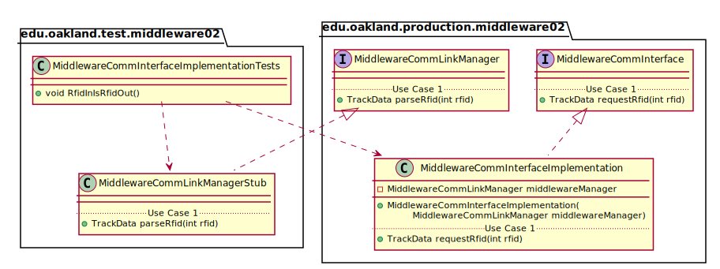

# UML Class Diagrams: edu.oakland.test.middleware02.MiddlewareCommInterfaceImplementationTests

**Primary Owner:** Kenzie King, Middleware_02 Team SCRUM Master ([@mckenzieking](https://github.com/mckenzieking/))

**Secondary Owners:**

- Kal Willard, Middleware_02 Team SCRUM Assistant Master ([@kwillard34](https://github.com/kwillard34/))
- Rio Capollari, Middleware_02 Team SCRUM Integrator ([@rcapollari](https://github.com/rcapollari/))

## Purpose

This class shall run unit tests on the [edu.oakland.production.middleware02.MiddlewareCommInterfaceImplementation](../../production/MiddlewareCommInterfaceImplementation) class.

## Class UML Diagram

Below is a diagram of the MiddlewareCommInterfaceImplementationTests interface itself:

View larger as [.png](./MiddlewareCommInterfaceImplementationTests.png) or [.svg](./MiddlewareCommInterfaceImplementationTests.svg)

## Direct Dependencies UML Diagram

Below is a diagram of the direct dependencies required by the MiddlewareCommInterfaceImplementationTests interface:

View larger as [.png](./MiddlewareCommInterfaceImplementationTests_DirectDependencies.png) or [.svg](./MiddlewareCommInterfaceImplementationTests_DirectDependencies.svg)

## Complete Dependency Closure UML Diagram

Below is a diagram of the complete dependencies closure of the MiddlewareCommInterfaceImplementationTests interface:

View larger as [.png](./MiddlewareCommInterfaceImplementationTests_Closure.png) or [.svg](./MiddlewareCommInterfaceImplementationTests_Closure.svg)
