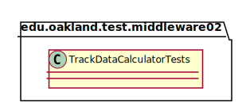
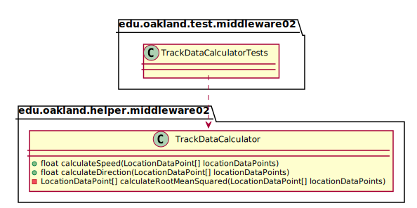

# UML Class Diagrams: edu.oakland.test.middleware02.TrackDataCalculatorTests

**Primary Owner:** Kenzie King, Middleware_02 Team SCRUM Master ([@mckenzieking](https://github.com/mckenzieking/))

**Secondary Owners:**

- Kal Willard, Middleware_02 Team SCRUM Assistant Master ([@kwillard34](https://github.com/kwillard34/))
- Rio Capollari, Middleware_02 Team SCRUM Integrator ([@rcapollari](https://github.com/rcapollari/))

## Purpose

This class shall run unit tests on the [edu.oakland.helper.middleware02.TrackDataCalculator](../../helper/TrackDataCalculator) class.

## Class UML Diagram

Below is a diagram of the TrackDataCalculatorTests class itself:

View larger as [.png](./TrackDataCalculatorTests.png) or [.svg](./TrackDataCalculatorTests.svg)

## Direct Dependencies UML Diagram

Below is a diagram of the direct dependencies required by the TrackDataCalculatorTests class:

View larger as [.png](./TrackDataCalculatorTests_DirectDependencies.png) or [.svg](./TrackDataCalculatorTests_DirectDependencies.svg)

## Complete Dependency Closure UML Diagram

Below is a diagram of the complete dependencies closure of the TrackDataCalculatorTests class:

View larger as [.png](./TrackDataCalculatorTests_Closure.png) or [.svg](./TrackDataCalculatorTests_Closure.svg)
